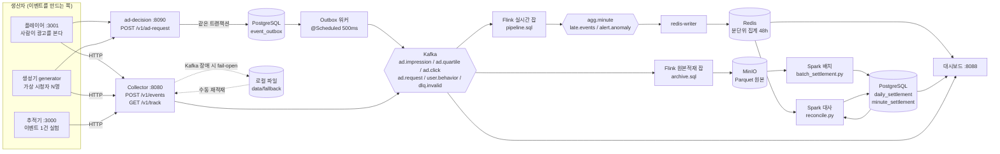
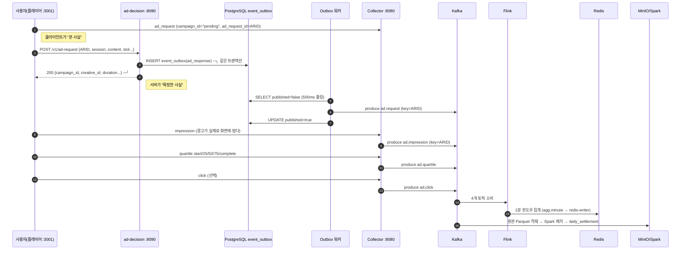

# 01. 이벤트는 어떻게 이동하는가

이벤트 한 건이 태어나서 정산 금액이 될 때까지 거치는 모든 홉을, **만들어지는 코드 위치 →
어떤 모양으로 → 어디에 앉는지 → 누가 읽는지** 순서로 적는다.
"지금 이 이벤트 어디 있지?" 를 코드를 안 열고도 짚을 수 있게 하는 것이 이 문서의 목적이다.

- 원본 데이터의 **스키마와 조회 방법**은 [02-data-stores.md](02-data-stores.md)
- 광고 결정 API 규격은 [03-ad-decision-api.md](03-ad-decision-api.md)

---

## 1. 한 장으로



핵심은 **두 갈래로 갈라졌다가 다시 만난다**는 것이다.

| 갈래 | 경로 | 지연 | 정확도 | 용도 |
|---|---|---|---|---|
| 실시간 | Kafka → Flink → Redis | 약 70초 | 근사값 (중복·지각 일부 포함/누락) | 모니터링, 이상 감지, 운영 판단 |
| 확정 | Kafka → Parquet → Spark → PostgreSQL | 배치 주기 (여기선 수동) | 정산 기준값 | 청구, 리포트 |

두 값은 **원래 다르다**. 얼마나 왜 다른지를 재는 것이 대사(reconciliation)이고,
그 차이의 원인이 지각·중복범위·SSAI 셋이라는 것이 이 프로젝트가 보여 주려는 것이다.

---

## 2. 광고 1편의 생애 (ad_request_id 하나를 따라간다)



`ad_request_id` 는 **광고 1편의 식별자이자 Kafka 파티션 키**다.
그래서 한 광고에서 파생된 request/impression/quartile/click 이 같은 파티션에 순서대로 앉는다
([`Topics.kt`](../collector/src/main/kotlin/com/ottads/collector/model/Topics.kt)).
플레이어의 [데이터 확인] 패널이 보여 주는 것이 정확히 이 묶음이다.

### 왜 같은 광고에 두 개의 "요청" 이벤트가 있나

| | `ad_request` | `ad_response` |
|---|---|---|
| 만든 주체 | 클라이언트(플레이어/생성기) | 서버(ad-decision) |
| 경로 | Collector → Kafka | **event_outbox → 워커 → Kafka** |
| campaign_id | `pending` (아직 모름) | 실제 캠페인 또는 `nofill` |
| 신뢰도 | 조작·유실 가능 | 서버가 DB 트랜잭션으로 확정 |
| 쓰임 | 요청 도달률 관찰 | **정합성 지표의 분모** |

집계에서 분모로 쓰는 것은 `ad_response AND fill=true` 뿐이다
([`sql/pipeline.sql`](../sql/pipeline.sql) 의 `all_events` 뷰, `spark/batch_settlement.py` 의 `requests`).
클라이언트가 보낸 수를 믿고 정산하면 조작에 그대로 뚫리기 때문이다.

---

## 3. 홉별 상세

### 3-1. 생산자 — 이벤트가 태어나는 세 곳

| 생산자 | 코드 | 성격 |
|---|---|---|
| 플레이어 | [`player/index.html`](../player/index.html) `emit()` → [`player/app.py`](../player/app.py) `/api/events` | 사람이 실제로 보는 화면. 광고 1편 = 요청 1 + 임프레션 1 + 쿼타일 5 + 클릭 0~1 |
| 생성기 | [`generator/users.py`](../generator/users.py) `VirtualUser.one_ad()` | 가상 시청자 N명. 시간을 빨리 감아 EPS 를 만든다 |
| 추적기 | [`tracer/app.py`](../tracer/app.py) `send()` | 이상 케이스 1건씩 실험 |

세 생산자는 **같은 이벤트 스키마와 같은 엔드포인트**를 쓴다. 파이프라인 입장에서 구분이 없다.
구분이 필요하면 `session_id` 접두사(`sess-play-`, `sess-`, `sess-trace`)나
`campaign_id` 로 나눠 본다.

이벤트 공통 필드(= Collector 필수 4개 + 선택):

```json
{
  "event_id":     "evt-play-3f9a...",      // 필수. 중복제거의 기준
  "event_type":   "impression",            // 필수. 토픽 라우팅의 기준
  "campaign_id":  "cmp-1001",              // 필수. 집계 키
  "event_time":   1789712345678,           // 필수. epoch ms 또는 ISO-8601
  "ad_request_id":"req-play-7c50...",      // 파티션 키. 없으면 event_id 로 폴백
  "creative_id":  "crt-1001-a",
  "session_id":   "sess-play-1a2b",
  "user_id":      "user-play-9f",
  "device":       "smart_tv",
  "content_id":   "ct-drama-201",
  "quartile":     "midpoint",              // event_type=quartile 일 때
  "ad_pod_id":    "pod-play-aa", "ad_slot": 0,
  "ad_duration_s":15, "playhead_s": 900,
  "source":       "client"                 // client | server (SSAI 스티처)
}
```

### 3-2. Collector — 수집

[`EventIngestService.ingest()`](../collector/src/main/kotlin/com/ottads/collector/service/EventIngestService.kt#L28)
한 함수가 전부다.

```
검증 ──실패──> dlq.invalid (reason + 원본 raw 보존)
 │
 성공
 ↓
보강  server_ts 추가 / event_time 을 ISO-8601 밀리초로 정규화 / ingest_endpoint 기록
 ↓
라우팅 event_type -> 토픽  (TopicRouter.kt)   알 수 없는 타입이면 dlq.invalid
 ↓
발행  key = ad_request_id ?: event_id
 │
 └─ Kafka 실패 ──> data/fallback/*.jsonl 에 append 후 "성공" 응답 (fail-open)
```

지켜야 할 규칙 두 가지가 코드에 박혀 있다.

1. **개별 이벤트가 틀려도 배치 전체를 거절하지 않는다** — 항상 202.
   400 을 주면 플레이어 SDK 가 배치를 통째로 재전송해 폭주한다.
2. **픽셀은 무조건 200 + 1x1 GIF** — 서명이 틀려도 그렇다.
   실패를 4xx 로 돌려주면 플레이어가 재시도를 반복한다. 대신 집계에는 한 건도 안 넣는다
   ([`TrackController.kt`](../collector/src/main/kotlin/com/ottads/collector/web/TrackController.kt)).

전송 경로는 둘이다.

| 경로 | 엔드포인트 | 쓰는 곳 | 특징 |
|---|---|---|---|
| 배치 | `POST /v1/events` | 플레이어 SDK, 생성기 | 최대 `max-batch-size` 건, 응답에 accepted/invalid/fallback 집계 |
| 픽셀 | `GET /v1/track?...&sig=` | VAST 트래킹 비콘 | HMAC-SHA256 서명 필수, 응답은 1x1 GIF |

플레이어 화면의 "이상 주입 → 쿼타일을 VAST 픽셀로 전송" 토글이 이 두 경로를 바꿔 가며 보여 준다.

### 3-3. Kafka — 버퍼

| 토픽 | 무엇이 들어오나 | 파티션(로컬/운영) |
|---|---|---|
| `ad.impression` | 광고가 화면에 떴다 | 6 / 48 |
| `ad.quartile` | start, first_quartile, midpoint, third_quartile, complete | 6 / 48 |
| `ad.click` | 클릭 | 6 / 48 |
| `ad.request` | `ad_request`(클라이언트) + `ad_response`(Outbox) | 6 / 48 |
| `user.behavior` | session_start/end, progress, pause/resume/seek, content_start/end | 6 / 48 |
| `dlq.invalid` | 검증 실패 원본 + 사유 | 6 / 48 |
| `agg.minute` | Flink 분단위 집계 결과 | 2 |
| `late.events` | 워터마크를 지나 도착한 이벤트 | 2 |
| `alert.anomaly` | 이상 감지 경고 | 2 |

파티션 키가 `ad_request_id` 인 이유와 그 대가(핫 키 위험)는 [05-kafka-guide.md](05-kafka-guide.md) 6장 참조.

### 3-4. Flink 실시간 잡 ([`sql/pipeline.sql`](../sql/pipeline.sql))

```
 impression ┐
 quartile   ├─ UNION ALL ─> event_id 중복제거 ─> 1분 텀블링 윈도우 ─> 캠페인 lookup join ─┬─> agg.minute
 click      │   (ROW_NUMBER)      (TTL 1시간)        (워터마크 10초)                      └─> alert.anomaly
 request*   ┘
 (* ad_response AND fill=true 만)

 impression/quartile/click ──> event_time < CURRENT_WATERMARK() ──> late.events
```

여기서 일어나는 네 가지 판단:

1. **중복 제거는 `event_id` 기준, 상태 TTL 1시간.** 1시간 뒤 도착한 재전송은 못 잡는다 → 배치가 메운다.
2. **SSAI 이중경로는 못 잡는다.** `event_id` 가 서로 다르기 때문. `ssai_dupes` 로 세기만 한다.
3. **윈도우는 워터마크가 지나야 닫힌다.** 트래픽이 끊기면 영영 안 닫힌다
   → 플레이어/추적기의 [워터마크 밀기] 버튼과 `scripts/flush-windows.sh` 가 그 대용이다.
   유휴 파티션이 워터마크를 붙잡는 문제는 `table.exec.source.idle-timeout` 으로 처리한다.
4. **lookup join 은 집계 뒤에 붙인다.** 이벤트마다 조인하면 초당 수천 번 DB 를 두드리지만,
   분단위 결과에 붙이면 캠페인 수만큼이면 끝난다.

### 3-5. redis-writer ([`redis-writer/writer.py`](../redis-writer/writer.py))

Flink 1.20 용 Redis **SQL** 커넥터가 없어서 생긴 한 홉이다.
`agg.minute` / `late.events` / `alert.anomaly` 를 소비해 Redis 에 넣고,
대시보드와 대사 잡이 읽을 HTTP(`:8099/agg/summary`, `/agg/series`)를 연다.
"스트림 → Kafka → 서빙 스토어" 는 실제 운영에서도 흔한 구성이라 크게 어긋나지 않는다.

### 3-6. Flink 원본 적재 잡 ([`sql/archive.sql`](../sql/archive.sql))

다섯 토픽을 **가공 없이** `s3a://events/dt=YYYY-MM-DD/hour=HH/` 로 Parquet 적재한다.
필터도, 중복 제거도, 집계도 없다. 지연·중복·SSAI 가 전부 그대로 들어간다.

- 파일 커밋 시점 = **체크포인트 완료 시점**(10초). Parquet 은 bulk 포맷이라 롤링 설정(1분)과 상관없이 체크포인트마다 파일을 닫는다.
- 그래서 "이벤트가 Parquet 로 보이기까지" 최대 약 10초. 대신 파일이 잘게 쪼개진다 ([08-minio-guide.md](08-minio-guide.md#4-flink-가-minio-에-쓰는-방식)).
- 체크포인트가 실패하면 파일이 안 보인다. 이건 버그가 아니라 exactly-once 파일 커밋의 성질이다.

### 3-7. Spark 배치 ([`spark/batch_settlement.py`](../spark/batch_settlement.py))

실시간이 못 한 두 가지를 한다.

| 단계 | 하는 일 | 실시간과 다른 점 |
|---|---|---|
| ② event_id 전체범위 중복제거 | `row_number() over (partition by event_id order by event_time)` | Flink 는 TTL 1시간 안에서만 |
| ③ SSAI 이중경로 정리 | `ad_request_id` 단위로 `source` 우선순위(server > client) 하나만 채택 | Flink 는 둘 다 센다 |
| ④ 일/캠페인 집계 | impressions/clicks/completes/requests/raw_impressions | |
| ⑤ CPM 조인 | `amount = impressions / 1000 * cpm` | |
| ⑥⑦ 기록 | `daily_settlement`(정산), `minute_settlement`(대시보드 겹쳐 그리기용) | truncate 후 전체 재적재 = 멱등 |

### 3-8. 대사 ([`spark/reconcile.py`](../spark/reconcile.py))

`확정 = 실시간 + 지연반영 − SSAI − 장기중복 (+ 잔차)` 로 차이를 분해해
`reconciliation` 테이블에 남긴다. 대시보드 하단의 "원인 분해" 칸이 이 값이다.

---

## 4. 언제 어디에 보이나 (지연 표)

| 지점 | 걸리는 시간 | 결정하는 설정 |
|---|---|---|
| Collector 응답 | 수 ms | — |
| Kafka 토픽 도착 | 수십 ms | `acks`, 배치 설정 |
| Outbox 경유(ad_response)만 | +0~0.5초 | `outbox.poll-interval-ms=500` |
| Redis 분집계 | 최대 약 70초 | 1분 윈도우 + `FLINK_WATERMARK_DELAY=10` |
| MinIO Parquet | 최대 약 10초 | 체크포인트 간격 10초 (bulk 포맷은 체크포인트마다 파일을 닫는다) |
| PostgreSQL 확정 | 배치 실행 시 | `scripts/batch.sh` (운영은 시간/일 단위 스케줄) |

부하가 없으면 Redis 단계가 계속 비어 있는 것이 정상이다. 워터마크를 밀 이벤트가 없기 때문이다.

---

## 5. 같은 이벤트가 경로마다 달라지는 세 경우

플레이어 오른쪽 [이상 주입] 탭에서 하나씩 켜고 광고를 한 편 보면 그대로 재현된다.

| 주입 | Kafka | Redis(실시간) | Parquet(원본) | PostgreSQL(확정) | 왜 |
|---|---|---|---|---|---|
| 정상 | 1건 | +1 | 1행 | 1 | 기준선 |
| 중복 재전송 | 2건 | +1 | 2행 | 1 | Flink 가 `event_id` 로 접는다 |
| SSAI 이중경로 | 2건 | **+2** | 2행 | 1 | `event_id` 가 달라 실시간은 못 접는다. 배치만 정리 |
| 60초 지연 | 1건 + `late.events` | **+0** | 1행 | 1 | 워터마크를 넘겨 윈도우가 버린다. 배치는 `event_time` 만 본다 |
| 스키마 위반 | `dlq.invalid` | 0 | 0행 | 0 | Collector 검증에서 탈락. 응답은 202 |
| 서명 위조 픽셀 | `dlq.invalid` | 0 | 0행 | 0 | HTTP 200 + GIF, 집계 제외 |

**"실시간 < 확정" 은 지연 때문이고, "실시간 > 확정" 은 SSAI·장기중복 때문이다.**
이 한 줄이 대사 표를 읽는 법의 전부다.

---

## 6. 직접 따라가 보기

### 화면으로

1. http://localhost:3001 에서 콘텐츠를 고른다 → 광고가 나온다
   (누구의 어떤 광고인지, `campaign_id` / `creative_id` / CPM 이 화면에 찍힌다)
2. 오른쪽 [이벤트 로그] 에서 방금 이벤트가 어느 토픽으로 갔는지 확인
3. 아래 [데이터 확인] 에서 그 광고 1편의 다섯 단계 도달 상태 확인
4. http://localhost:8088 에서 전체 카운터가 올라가는지 확인

### CLI 로

```bash
# 1) Kafka 원문
docker compose exec kafka /opt/kafka/bin/kafka-console-consumer.sh \
  --bootstrap-server localhost:9092 --topic ad.impression --max-messages 3 --from-beginning

# 2) 특정 광고만 (jq 필터)
docker compose exec kafka /opt/kafka/bin/kafka-console-consumer.sh \
  --bootstrap-server localhost:9092 --topic ad.request --from-beginning --timeout-ms 5000 \
  | grep req-play-

# 3) Redis 분단위 집계
docker compose exec redis redis-cli --raw keys 'agg:1m:cmp-1001:*' | tail -3
docker compose exec redis redis-cli hgetall agg:1m:cmp-1001:$(date -u +%Y%m%d%H%M)

# 4) Outbox 행
docker compose exec postgres psql -U ads -d adplatform \
  -c "select id,event_id,published,occurred_at from event_outbox order by id desc limit 5;"

# 5) 확정 집계 (배치 후)
bash scripts/flush-windows.sh && bash scripts/batch.sh && bash scripts/recon.sh
docker compose exec postgres psql -U ads -d adplatform -c "table daily_settlement;"
```

Parquet 원본을 직접 까 보는 방법은 [02-data-stores.md](02-data-stores.md#4-minio-parquet-원본) 에 있다.
