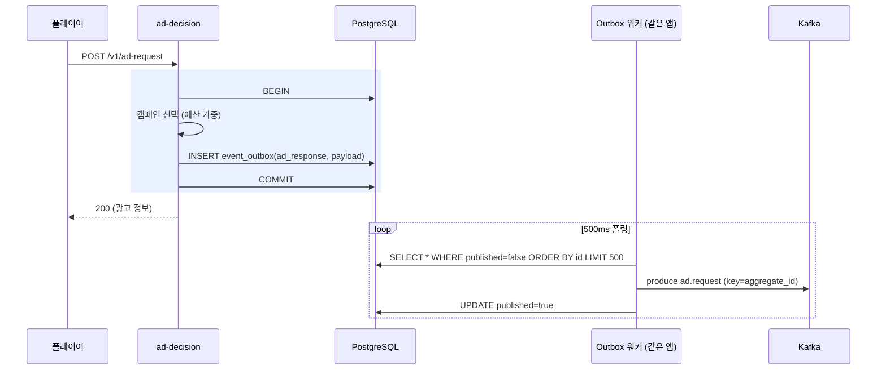

# 03. 광고 결정 API (ad-decision)

> **먼저 확인**: 광고 결정 API 는 **처음부터 구현되어 있었다.**
> 서비스는 [`ad-decision/`](../ad-decision) (Kotlin / Spring Boot, 포트 8090),
> 엔드포인트는 `POST /v1/ad-request`,
> 결정 로직은 [`DecisionService.decide()`](../ad-decision/src/main/kotlin/com/ottads/addecision/service/DecisionService.kt) 다.
> 눈에 안 띄었던 이유는 **호출하는 화면이 없었기 때문**이다.
> 지금까지는 생성기(부하 도구)와 추적기의 버튼 하나만 이 API 를 불렀고,
> 응답은 `campaign_id` / `creative_id` 같은 ID 뿐이라 "무슨 광고인지" 가 어디에도 안 보였다.
>
> 이번에 보완한 것:
> 1. 응답에 **캠페인 메타(광고주·캠페인명·업종·CPM)** 와 스킵 오프셋·클릭 URL·비콘 목록 추가
> 2. `GET /v1/campaigns` 신설 — 지금 집행 가능한 캠페인 목록
> 3. **플레이어 화면(:3001)** 이 이 API 를 호출해 "누구의 어떤 광고인지" 를 그대로 렌더
> 4. 이 문서 (규격 정의)

---

## 1. 이 API 의 책임

```
플레이어가 광고 슬롯에 닿았다
        │
        ├─ (1) 무엇을 틀지 정한다            ← 결정 (fill / no-fill, 캠페인, 소재, 길이)
        ├─ (2) 정한 것을 사실로 기록한다      ← event_outbox INSERT (같은 트랜잭션)
        └─ (3) 플레이어가 재생·계측할 수 있게 재료를 준다  ← 소재 정보 + 비콘 목록
```

(2)가 이 서비스의 존재 이유다. **광고를 내보내기로 한 결정은 서버만 아는 사실**이고,
그게 집계의 분모가 된다. 클라이언트가 보낸 수를 믿으면 조작에 뚫린다.

---

## 2. 엔드포인트

### 2-1. `POST /v1/ad-request` — 소재 결정

요청 (전부 선택값. 없으면 서버가 채우거나 기본값):

| 필드 | 타입 | 뜻 |
|---|---|---|
| `ad_request_id` | string | 광고 1편의 식별자. **Kafka 파티션 키**가 된다. 없으면 서버가 발급 |
| `session_id` | string | 재생 세션 |
| `user_id` | string | 사용자 (운영이라면 타게팅/빈도제어의 키) |
| `content_id` | string | 재생 중인 콘텐츠 |
| `device` | string | `smart_tv` \| `mobile` \| `tablet` \| `pc` \| `stb` |
| `ad_pod_id` | string | 연속 광고 묶음(팟) 식별자 |
| `ad_slot` | int | 팟 안에서 몇 번째 (0부터) |
| `playhead_s` | number | 광고가 끼어드는 콘텐츠 재생 위치(초) |
| `max_duration_s` | int | 이 슬롯이 허용하는 최대 광고 길이. 기본 30 |
| `prefer_campaign_id` | string | **데모용**. 이 캠페인으로 채워 달라 (없거나 비활성이면 무시) |
| `force_no_fill` | bool | **데모용**. 노필 화면을 재현할 때 |

> `prefer_campaign_id` / `force_no_fill` 은 운영 API 에는 없는 필드다.
> 화면에서 "노필이 나면 어떻게 되나" 를 재현하려고 열어 둔 것이고, 실서비스라면 제거하거나
> 내부 인증이 있는 디버그 경로로 분리해야 한다.

응답 (실측):

```bash
curl -s -X POST http://localhost:8090/v1/ad-request -H 'Content-Type: application/json' -d '{
  "ad_request_id":"req-test-001","session_id":"s1","user_id":"u1",
  "content_id":"ct-drama-201","device":"smart_tv","ad_pod_id":"pod1",
  "ad_slot":0,"playhead_s":900,"max_duration_s":30}'
```
```json
{
  "ad_request_id": "req-test-001",
  "fill": true,
  "no_fill_reason": null,
  "campaign_id": "cmp-1005",
  "campaign_name": "냉동간편식 신제품",
  "advertiser": "한강식품",
  "vertical": "fmcg",
  "cpm": 6000.0,
  "creative_id": "crt-1005-a",
  "ad_duration_s": 30,
  "skippable_after_s": 5,
  "click_through_url": "https://ads.example.com/click/cmp-1005?arid=req-test-001",
  "tracking_events": [
    {"event":"impression","quartile":null,"offset_pct":0.0},
    {"event":"quartile","quartile":"start","offset_pct":0.0},
    {"event":"quartile","quartile":"first_quartile","offset_pct":0.25},
    {"event":"quartile","quartile":"midpoint","offset_pct":0.5},
    {"event":"quartile","quartile":"third_quartile","offset_pct":0.75},
    {"event":"quartile","quartile":"complete","offset_pct":1.0}
  ],
  "decision_ms": 115
}
```

노필:

```json
{"ad_request_id":"req-1cb5...","fill":false,"no_fill_reason":"policy",
 "campaign_id":null,"tracking_events":[],"decision_ms":1}
```

| 응답 필드 | 뜻 |
|---|---|
| `fill` | 채웠는가. false면 이 슬롯은 impression 이하가 발생하지 않는다 |
| `no_fill_reason` | `no_campaign`(집행 캠페인 없음) \| `budget_exhausted` \| `policy`(강제) |
| `campaign_name` / `advertiser` / `vertical` / `cpm` | **화면에 "무슨 광고인지" 를 그리는 데 쓰는 메타.** `campaigns` + `campaign_rates` 조인 결과 |
| `skippable_after_s` | 이 초가 지나면 건너뛰기 버튼이 뜬다. null이면 스킵 불가 |
| `tracking_events` | 플레이어가 쏴야 하는 비콘 목록. VAST `TrackingEvents` 의 축약형 |
| `decision_ms` | 서버 내부 결정 소요(밀리초). 화면 하단 칩에 그대로 찍힌다 |

HTTP 상태: 항상 200(노필 포함). 4xx/5xx 는 진짜 오류일 때만 —
**"광고가 없음" 은 오류가 아니다.** 노필을 4xx 로 주면 플레이어 SDK 가 재시도를 돌린다.

### 2-2. `GET /v1/campaigns` — 집행 중인 캠페인

```bash
curl -s http://localhost:8090/v1/campaigns
```
```json
{"count":5,"campaigns":[
  {"campaignId":"cmp-1001","advertiser":"한빛통신","name":"5G 무제한 요금제",
   "vertical":"telco","dailyBudget":5000000.0,"cpm":9500.0}, ...]}
```

`CampaignCache` 가 60초 주기로 DB 에서 갱신한 스냅샷이다.
즉 **방금 INSERT 한 캠페인은 최대 60초 늦게 보인다.**
플레이어 홈의 "집행 중인 광고 캠페인" 목록이 이 응답이고,
예산 0인 내부용 캠페인(`cmp-tr-*`, `cmp-9999`)은 화면 쪽에서 걸러 낸다.

### 2-3. `GET /v1/outbox/stats` — 발행 적체

```json
{"unpublished":0,"maxLagSeconds":0,"publishedTotalRuntime":4680,"rowsTotal":4680,"campaignsLoaded":15}
```

대시보드 [정합성] 패널과 시나리오 스크립트가 읽는다.
`unpublished` 가 계속 늘면 워커가 Kafka 에 못 쓰고 있다는 뜻이다.

### 2-4. 액추에이터

`GET /actuator/health`, `/actuator/prometheus` (Micrometer 지표: 결정 수, fill/nofill, 발행/재발행/적체).

---

## 3. 결정과 기록이 한 트랜잭션 — Outbox 패턴



**왜 여기서 바로 Kafka 에 안 쓰나**: DB 커밋과 Kafka 발행은 하나의 원자 단위가 될 수 없다.
같은 자리에서 발행하면 "커밋됐는데 발행 실패"(유실) 또는 "발행됐는데 롤백"(유령 이벤트)이 생긴다.
그래서 트랜잭션에는 DB 쓰기만 넣고 발행은 워커가 따로 한다.
**대가는 중복이다(at-least-once).** 유실보다 중복이 낫다는 선택이고,
중복은 뒤(Flink `event_id` 중복제거 + Spark 전체범위 중복제거)에서 걷어낸다.

워커 구현에서 알아 둘 두 가지 ([`OutboxWorker.kt`](../ad-decision/src/main/kotlin/com/ottads/addecision/service/OutboxWorker.kt)):

- 발행 실패 시 그 배치에서 **멈춘다**(`break`). 순서를 지키기 위해서다.
- 로컬은 워커가 1개라 잠금이 없다. **인스턴스를 늘리면 `FOR UPDATE SKIP LOCKED` 가 필수**다
  (안 붙이면 모든 워커가 같은 행을 집어 중복이 인스턴스 수만큼 늘어난다).

---

## 4. 지금 구현 vs 실제 광고 서버

| 기능 | 이 구현 | 운영 광고 서버 | 넣는다면 어디에 |
|---|---|---|---|
| 캠페인 선택 | 일 예산 가중 랜덤 | 타게팅 → 필터 → 랭킹(eCPM) → 페이싱 | `CampaignCache.pick()` 를 전략 인터페이스로 |
| 타게팅 | 없음 | 지역·디바이스·시간·콘텐츠 장르·세그먼트 | 요청 필드는 이미 받고 있다. 조건 테이블 + 인덱스 |
| 빈도 제어(frequency cap) | 없음 | 사용자×캠페인 노출 횟수 상한 | Redis `INCR user:cap:<uid>:<cid>` + TTL |
| 예산 페이싱 | 없음 | 일 예산을 하루에 고르게 소진 | 분 단위 소진량을 Redis 에 누적, 초과 시 제외 |
| 경쟁 배제 | 없음 | 같은 팟에 동일 업종 2편 금지 | 요청의 `ad_pod_id` 로 팟 상태 유지 |
| 입찰(RTB) | 없음 | OpenRTB 로 외부 DSP 입찰 병렬 호출, 타임아웃 예산 | 별도 bidder 모듈, 100ms 데드라인 |
| 응답 포맷 | 자체 JSON | **VAST 4.x XML** (또는 VMAP 로 팟 전체) | 지금 응답을 VAST 로 직렬화하는 어댑터 |
| 비콘 URL | 이벤트 이름만 | 서명된 전체 URL 을 VAST 에 담아 전달 | `SignatureVerifier` 와 같은 규칙으로 URL 생성 |
| 소재 저장 | `cmp-`→`crt-` 문자열 규칙 | creatives 테이블 + CDN, 트랜스코딩 프로파일 | `creatives` 테이블 신설 |
| SSAI | 없음 (이벤트로만 흉내) | 스티처가 서버에서 광고를 붙여 단일 스트림 생성 | 별도 스티칭 서비스 |

### 성능 목표와 현재 구조

광고 결정은 **재생 흐름을 막는 동기 호출**이다. 실제 기준은 보통 p99 50~100ms 이내다.

| 항목 | 현재 | 1억 건 규모에서 |
|---|---|---|
| 캠페인 조회 | 60초 주기 메모리 캐시 (DB 안 탐) | 그대로 유효. 캠페인 수만 늘면 인덱스 구조 필요 |
| **Outbox INSERT** | 요청마다 **동기 DB 쓰기 1회** | **여기가 병목** — 초당 수천 INSERT. [04-scale-100m.md](04-scale-100m.md#3-4-광고-결정과-outbox) 참조 |
| 커넥션 | Hikari max 15 | 인스턴스당 20~30 + PgBouncer |
| 결정 로직 | O(캠페인 수) 선형 스캔 | 인덱싱/후보 축소 필요 |

---

## 5. 직접 호출해 보기

```bash
# 정상 요청
curl -s -X POST http://localhost:8090/v1/ad-request -H 'Content-Type: application/json' \
  -d '{"session_id":"s1","user_id":"u1","content_id":"ct-drama-201","ad_pod_id":"p1"}' | python -m json.tool

# 특정 캠페인 강제 (화면에서 특정 광고를 보고 싶을 때)
curl -s -X POST http://localhost:8090/v1/ad-request -H 'Content-Type: application/json' \
  -d '{"prefer_campaign_id":"cmp-1003","session_id":"s1","user_id":"u1","ad_pod_id":"p1"}'

# 노필 재현
curl -s -X POST http://localhost:8090/v1/ad-request -H 'Content-Type: application/json' \
  -d '{"force_no_fill":true,"session_id":"s1","user_id":"u1","ad_pod_id":"p1"}'

# 방금 결정이 Outbox 에 남았는지
docker compose exec postgres psql -U ads -d adplatform \
  -c "select id, aggregate_id, published, payload->>'campaign_id' from event_outbox order by id desc limit 3;"

# Kafka 까지 갔는지
docker compose exec kafka /opt/kafka/bin/kafka-console-consumer.sh \
  --bootstrap-server localhost:9092 --topic ad.request --timeout-ms 4000 --from-beginning | grep ad_response | tail -1
```

화면으로 보려면 http://localhost:3001 에서 콘텐츠를 재생하면 된다 —
광고 브레이크마다 이 API 가 호출되고, 결정 결과가 그대로 화면의 광고가 된다.
