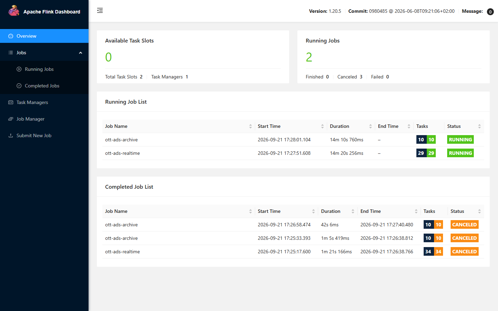
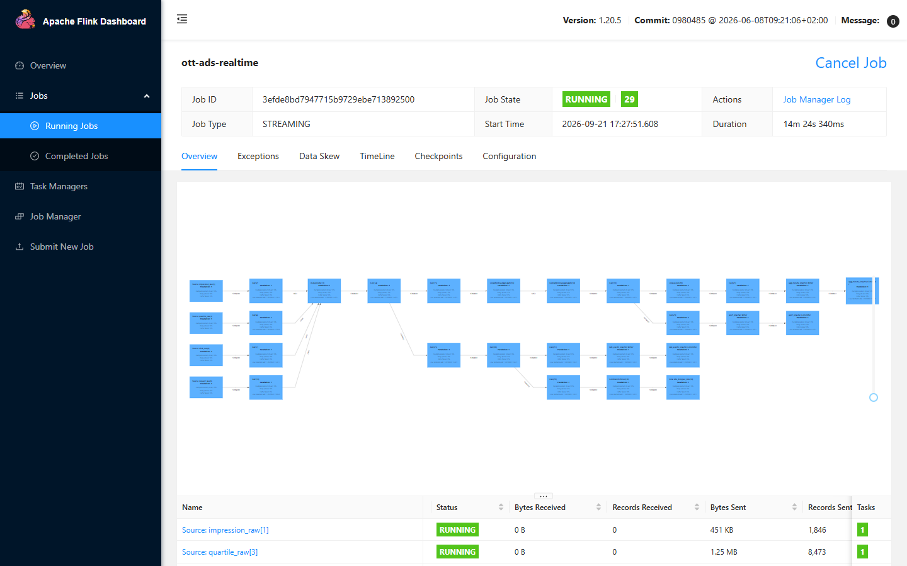
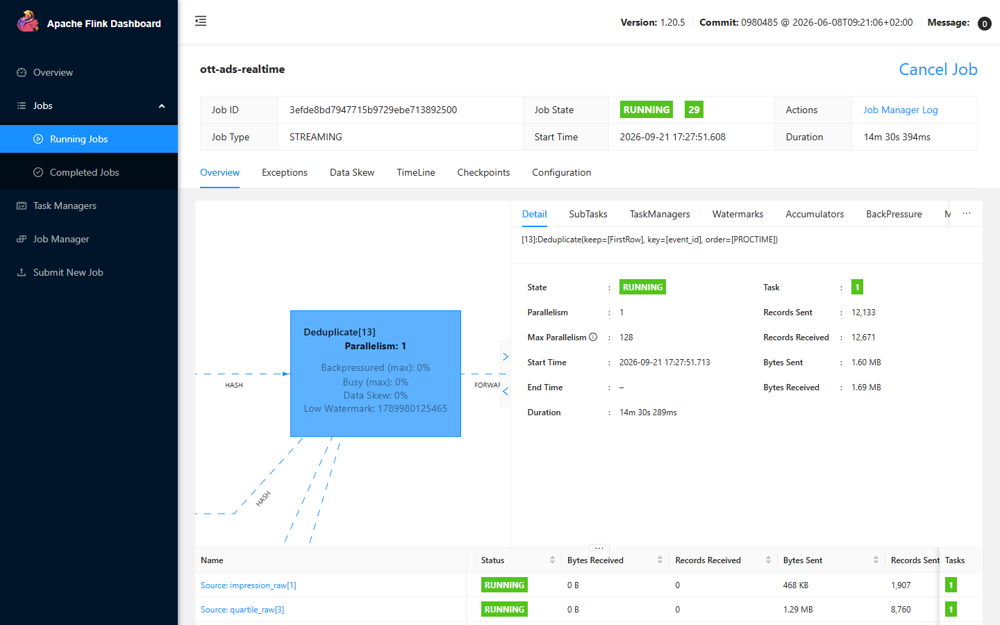
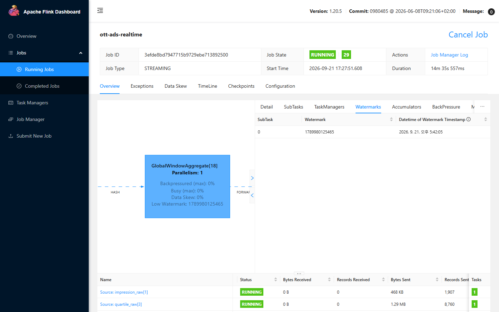
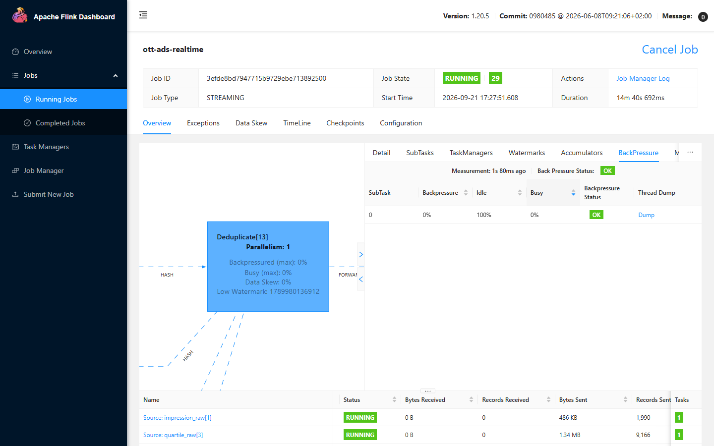
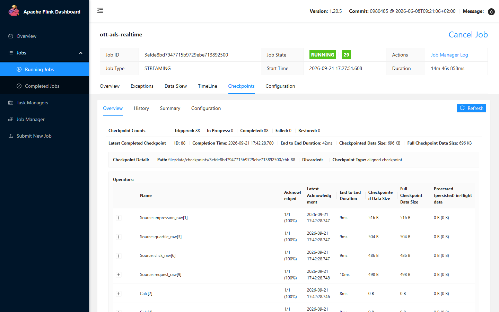
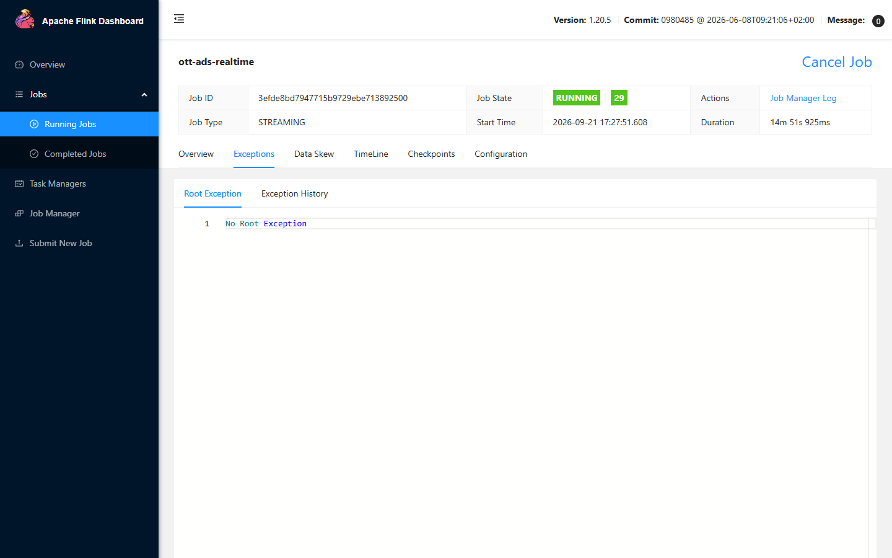
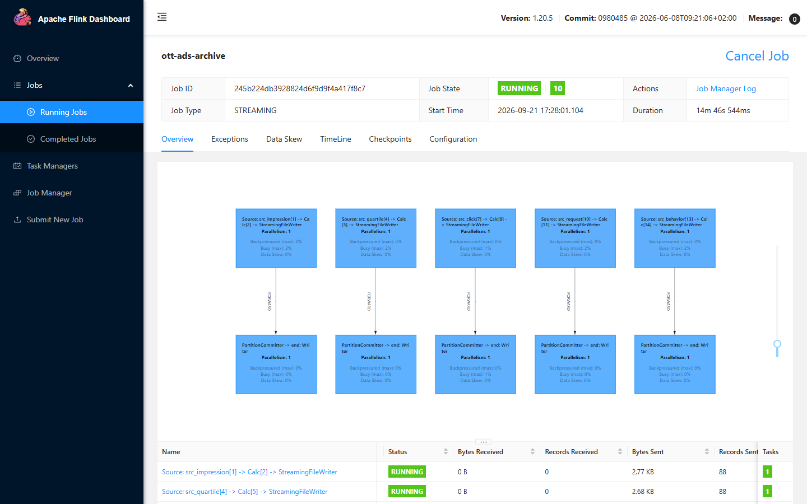

# 07. Flink — 무슨 일을 하고, 화면(:8181)은 어떻게 읽나

Flink UI 는 처음 보면 박스와 숫자만 가득하다. 이 문서는 **이 저장소의 두 잡을 교재 삼아**
어느 화면에서 무엇을 봐야 하는지 순서대로 적는다. 캡처는 부하(`USERS=80`)를 걸어 둔 상태의 실제 화면이다.

- 주소: http://localhost:8181 (로그인 없음)
- 잡 정의: [`sql/pipeline.sql`](../sql/pipeline.sql), [`sql/archive.sql`](../sql/archive.sql)
- 잡 제출: `bash scripts/flink-submit.sh`, `bash scripts/flink-archive.sh`

---

## 1. Flink 는 여기서 무슨 일을 하나

Kafka 에 쌓이는 이벤트를 **흐르는 채로 계산하는 엔진**이다. 이 저장소에는 잡이 두 개 있다.

| 잡 | 하는 일 | 결과가 가는 곳 |
|---|---|---|
| **ott-ads-realtime** | 4개 토픽 합류 → `event_id` 중복제거 → 1분 윈도우 집계 → 캠페인 메타 조인 → 이상 감지 · 지각 분리 | `agg.minute` → redis-writer → Redis / `alert.anomaly` / `late.events` + Postgres `late_dropped` |
| **ott-ads-archive** | 5개 토픽을 **가공 없이** 그대로 옮긴다 | MinIO `s3a://events/dt=/hour=/` Parquet ([08-minio-guide.md](08-minio-guide.md)) |

### 왜 파이썬 컨슈머로 안 하고 Flink 인가

Kafka 컨슈머 스크립트로도 "읽어서 세기" 는 된다. Flink 가 필요한 이유는 아래 세 가지를 직접 만들기 어렵기 때문이다.

| 필요한 것 | 직접 만들면 | Flink 에서는 |
|---|---|---|
| **이벤트 시간 기준 1분** | 늦게 도착한 이벤트를 어느 분에 넣을지, 언제 그 분을 닫을지 직접 판단 | `WATERMARK FOR event_time AS event_time - INTERVAL '10' SECOND` 한 줄 |
| **상태** (본 적 있는 `event_id` 1시간치) | 메모리/Redis 에 직접 보관, 만료, 복구 | `ROW_NUMBER() ... WHERE rn = 1` + `table.exec.state.ttl = 1h` |
| **장애 복구** | 오프셋 커밋과 상태 저장을 원자적으로 맞추기 | 체크포인트가 **Kafka 오프셋 + 상태**를 한 스냅샷으로 저장 |

---

## 2. 첫 화면 — Overview



| 항목 | 지금 값 | 읽는 법 |
|---|---|---|
| **Available Task Slots** | **0** / Total 2 | 잡 2개가 슬롯을 하나씩 쓰고 있다. **여기서 잡을 하나 더 올리면 에러 없이 대기 상태로 멈춘다.** "잡이 안 뜬다" 는 대개 이것 |
| Task Managers | 1 | 실제로 연산을 수행하는 워커 컨테이너(`ottads-flink-tm`) 수 |
| Running Jobs | 2 | `ott-ads-realtime`, `ott-ads-archive` |
| Tasks `29 29` / `10 10` | 전체 / 실행 중 | 두 숫자가 다르면 일부 연산자가 아직 못 떴거나 재시작 중 |

잡 이름을 누르면 잡 상세로 들어간다.

---

## 3. 잡 그래프 — 박스를 SQL 과 맞춰 읽기



**박스 하나 = 연산자(vertex) 하나**다. 화살표 위 글자는 데이터를 넘기는 방식이다.

| 화살표 | 뜻 | 이 잡에서 |
|---|---|---|
| `FORWARD` | 같은 서브태스크로 그대로 넘긴다. 네트워크를 안 탄다 | Source → Calc |
| `HASH` | 키로 다시 나눠 보낸다(셔플). 병렬도가 크면 **네트워크 비용이 여기서 생긴다** | Deduplicate 앞(`event_id` 기준), 윈도우 앞(`campaign_id` 기준) |

박스가 29개나 되는 이유는 `pipeline.operator-chaining = false` 로 **체이닝을 일부러 껐기 때문**이다.
켜면 인접한 FORWARD 연산자가 한 박스로 합쳐져 단계별 건수를 볼 수 없다.
아래 archive 잡(체이닝 켜짐)과 비교하면 차이가 보인다. 운영에서는 성능을 위해 켠다.

### 박스와 SQL 대응표 (그래프 아래 표의 Records Received / Records Sent)

```
Source: impression_raw ─ Calc[2]  ─┐
Source: quartile_raw   ─ Calc[4]  ─┤
Source: click_raw      ─ Calc[7]  ─┤
Source: request_raw    ─ Calc[10] ─┘  ← WHERE event_type='ad_response' AND fill=TRUE  (필터: in > out)
                                   │
Deduplicate[13]   ← 4개 입력 합류 + ROW_NUMBER() OVER (PARTITION BY event_id ORDER BY 도착순)
                    in = 4개 Calc out 의 합,  in − out = 걸러낸 중복
Calc[14]
  │
  ├─ 집계 경로
  │   Calc[15] → LocalWindowAggregate[16]   ← TUMBLE 1분, 1단계(부분 집계)
  │            → GlobalWindowAggregate[18]  ← 최종 집계. out = "캠페인 × 분" 행 수
  │            → Calc[19] ─┬─ LookupJoin[20] → Calc[21] → agg_minute_sink   → Kafka agg.minute
  │                        │     ← campaigns 테이블에서 광고주/캠페인명 (Postgres, 5분 캐시)
  │                        └─ Calc[23] → alert_sink                         → Kafka alert.anomaly
  │                              ← 같은 집계 결과에서 imp/req 비율이 임계치 밑인 것만
  │
  └─ 지각 경로
      Calc[25]  ← 이벤트가 속한 1분 창의 끝(window_end)과 현재 워터마크 계산
      Calc[26]  ← 워터마크 >= window_end - 1ms 인 것만 = 윈도우가 이미 닫혀 버리는 것
        ├─ Calc[27] → late_events_sink                  → Kafka late.events   (관찰용)
        └─ Calc[29] → ConstraintEnforcer → late_dropped_sink → Postgres late_dropped (대사용, event_id upsert)
```

**중복제거와 윈도우 집계가 하나씩만 있다.** 세 싱크 경로가 같은 `Deduplicate[13]` 을,
집계·경고가 같은 `GlobalWindowAggregate[18]` 을 공유한다
(`table.optimizer.reuse-optimize-block-with-digest-enabled`). 이 설정이 없으면 옵티마이저가 경로마다
안 쓰는 컬럼을 먼저 잘라 모양이 달라지고, 같은 중복제거가 경로 수만큼 생긴다 (상태가 그만큼 는다).

**지각 판정은 중복제거 뒤, 윈도우와 같은 조건으로 한다.** 윈도우는 "이벤트가 속한 1분 창이 이미 닫혔을 때" 만
버린다. `event_time < 워터마크` 로 판정하면 창이 아직 열려 있어 실시간에 집계된 것까지 지각으로 세게 된다
(예: 워터마크 12:00:40 에 12:00:30 이벤트 → 워터마크보다 과거지만 [12:00, 12:01) 창은 열려 있다).

실측 예 — realtime 잡이 이만큼 처리한 시점의 값:

| 박스 | in → out | 뜻 |
|---|---|---|
| `Calc[10]` | 2,745 → 1,252 | ad.request 중 서버 확정 `ad_response` 만 남았다 |
| `Deduplicate[13]` | 8,672 → 8,284 | 1,296 + 5,995 + 129 + 1,252 = 8,672 합류, **중복 388건 제거** |
| `LocalWindowAggregate[16]` | 8,284 → 208 | 부분 집계 |
| `GlobalWindowAggregate[18]` | 208 → 19 | 19 = 캠페인 × 분 |
| `Calc[23]` (경고 경로) | 19 → 0 | 경고 조건에 걸린 윈도우 없음 |
| `Calc[26]` (지각 경로) | 8,284 → 354 | **윈도우가 버린 354건** → late.events 와 late_dropped 에 같은 354건 |

(2026-09-21, 기본 이상 비율로 3분 부하 후 flush 까지 마친 시점. 지각 354건은 impression 외
quartile·click·request 를 모두 포함한 수다. 대사에 쓰는 건 그중 impression 이다.)

### 숫자를 읽을 때 속기 쉬운 세 가지

1. **Source 박스의 Records Received 는 항상 0 이다.** Kafka 에서 읽는 건 Flink 내부 전달이 아니라서 안 센다. Source 는 Records **Sent** 를 본다.
2. **sink 의 `Writer` / `Committer` 숫자(수백~수천)는 이벤트 수가 아니다.** 체크포인트마다 오가는 커밋 신호다. archive 잡 표의 `Records Sent 819` 도 체크포인트 횟수(819)와 같다.
3. **윈도우 연산자의 out 은 이벤트 수가 아니라 "닫힌 윈도우 행" 수다.** 1분에 캠페인 5개면 분당 5행.

---

## 4. 박스를 누르면 — 연산자 상세



박스 안의 네 줄이 이 연산자의 건강 상태다.

| 표시 | 뜻 | 정상 |
|---|---|---|
| `Backpressured (max)` | 뒤 연산자가 못 받아서 **기다린** 시간 비율 | 0% 근처 |
| `Busy (max)` | 실제로 **일한** 시간 비율 | 낮을수록 여유 |
| `Data Skew` | 병렬 서브태스크 간 처리량 편차 (병렬도 1이면 항상 0%) | 낮을수록 좋음 |
| `Low Watermark` | 이 연산자가 보고 있는 이벤트 시간 (epoch ms) | 현재 시각을 따라와야 함 |

그래프에서 박스 색도 이것을 반영한다 — **한가하면 푸르고, 바쁠수록 붉어진다.**

오른쪽 탭:

| 탭 | 볼 것 |
|---|---|
| **Detail** | 연산자 원문(`[13]:Deduplicate(keep=[FirstRow], key=[event_id], order=[PROCTIME])`)과 누적 건수 |
| SubTasks | 병렬 인스턴스별 건수. 병렬도를 올린 뒤 쏠림 확인용 |
| **Watermarks** | 5절 |
| **BackPressure** | 6절 |
| Metrics | 원하는 지표를 골라 그래프로 (예: `numRecordsInPerSecond`) |
| FlameGraph | CPU 를 어디서 쓰는지. 기본 설정에서는 꺼져 있다 |

---

## 5. Watermarks — "왜 Redis 에 결과가 안 나오지?" 의 답



`Datetime of Watermark Timestamp` 가 **현재 시각의 10초 전쯤**을 따라오면 정상이다
(워터마크 지연 = `FLINK_WATERMARK_DELAY=10`). 화면의 시각은 브라우저 로컬 시간(KST)으로 보인다.

워터마크가 **멈춰 있으면**:

| 원인 | 확인 | 조치 |
|---|---|---|
| 트래픽이 없다 | 대시보드 입력 건/초가 0 | 정상이다. 플레이어에서 재생하거나 [워터마크 밀기] |
| 일부 파티션만 조용하다 | 워터마크는 **모든 파티션의 최솟값** | `table.exec.source.idle-timeout` (기본 5초) — 이미 설정돼 있다 |
| 이벤트가 전부 과거 시각 | `late.events` 가 급증 | 생산자 시계 확인 |

**워터마크가 윈도우 끝(예: 07:05:00)을 지나야 그 1분이 닫히고** `agg.minute` → Redis 로 나간다.
실제로 트래픽이 없을 때 이 화면을 보면 워터마크가 한 시간 전에 멈춰 있는 것을 볼 수 있다.
그 상태에서 플레이어의 [데이터 확인] 3단계(Redis)가 계속 대기로 남는 이유가 바로 이것이다.

---

## 6. BackPressure — 느려질 때 병목 찾기



`Back Pressure Status` 가 `OK / LOW / HIGH` 로 나온다. 읽는 규칙은 하나다.

> **HIGH 인 박스가 아니라, 그 바로 다음(하류) 박스가 병목이다.**
> 백프레셔는 "뒤가 안 받아 줘서 기다렸다" 는 뜻이기 때문이다.

그래서 그래프를 **뒤에서부터** 보면서 `Busy` 가 높은 첫 박스를 찾는다.
이 저장소에서 부하를 올렸을 때 먼저 바빠지는 곳은 `Deduplicate`(상태 조회)와 `LookupJoin`(DB 조회)이다.

---

## 7. Checkpoints — 장애가 나도 복구되는가



| 항목 | 캡처 값 | 읽는 법 |
|---|---|---|
| Triggered / Completed / **Failed** | 819 / 819 / **0** | Failed 가 늘기 시작하면 경고. 복구는 **마지막 성공 지점**으로만 된다 |
| Restored | 0 | 장애 후 체크포인트에서 복구한 횟수. `scenario_flink_kill.sh` 를 돌리면 올라간다 |
| Checkpointed Data Size | 319 KB | 대부분 중복제거용 `event_id` 상태. 트래픽이 늘면 같이 는다 ([04](04-scale-100m.md#3-3-flink-실시간-처리)) |
| End to End Duration | 27 ms | 체크포인트 간격(10초)에 가까워지면 위험 |
| Path | `file:/data/checkpoints/<jobid>/chk-819` | 호스트의 `data/checkpoints/` 에 실제 파일이 있다 |
| Type | aligned checkpoint | 백프레셔가 심하면 unaligned 로 바꾸는 선택지가 있다 |

**archive 잡에서는 체크포인트가 곧 Parquet 파일 확정 시점이다.**
체크포인트가 실패하면 MinIO 에 파일이 안 보인다 ([08-minio-guide.md](08-minio-guide.md#4-flink-가-minio-에-쓰는-방식)).

`History` 탭에서 개별 체크포인트의 소요 시간 추이를, `Summary` 탭에서 min/avg/max 를 본다.

---

## 8. 그 밖의 탭

| 위치 | 볼 것 |
|---|---|
| 잡 → **Exceptions** | 잡이 재시작을 반복할 때 원인 스택트레이스. 평소엔 `No Root Exception` (아래 캡처) |
| 잡 → TimeLine | 각 연산자가 언제 뜨고 언제 RUNNING 이 됐는지 |
| 잡 → Configuration | 제출 시 적용된 설정(병렬도, 체크포인트 간격 등) 최종값 |
| 왼쪽 → **Task Managers** | 메모리(힙/매니지드/네트워크) 사용량, **Logs / Stdout** |
| 왼쪽 → Job Manager | 클러스터 설정, JobManager 로그 |



---

## 9. archive 잡 그래프 — 체이닝이 켜진 모습



`Source: src_impression -> Calc -> StreamingFileWriter` 처럼 **세 연산자가 한 박스**로 묶여 있다.
이게 체이닝이다. 같은 스레드에서 함수 호출로 넘기므로 빠르지만, 중간 단계 건수는 볼 수 없다.
아래 `PartitionCommitter -> end: Writer` 는 체크포인트가 끝날 때 파일을 확정하고 `_SUCCESS` 를 쓰는 연산자다.

---

## 10. 상황별로 어디를 보나

| 증상 | 볼 곳 |
|---|---|
| 새 잡이 안 뜬다 | Overview 의 **Available Task Slots** |
| Redis 집계가 안 나온다 | 윈도우 박스 → **Watermarks** (멈춰 있나) |
| 대시보드 숫자가 점점 늦어진다 | **BackPressure**, 박스 색, `Busy` |
| 중복을 몇 건 걸렀나 | `Deduplicate` 의 in − out |
| 지각 이벤트가 생겼나 | 지각 경로 `Calc[26]` 의 out |
| 경고가 왜 안/왜 나나 | 경고 경로 `Calc[23]` 의 out |
| Parquet 파일이 안 생긴다 | archive 잡 → **Checkpoints** 의 Failed |
| 잡이 계속 재시작한다 | **Exceptions** |
| 메모리 부족 의심 | **Task Managers** → 메모리 |

같은 정보를 CLI 로 보려면 REST API 를 직접 부르면 된다 (UI 도 이것을 쓴다).

```bash
curl -s localhost:8181/overview                              # 슬롯·잡 수
curl -s localhost:8181/jobs/overview                         # 잡 목록과 상태
curl -s localhost:8181/jobs/<jobid>                          # 연산자별 read/write-records
curl -s localhost:8181/jobs/<jobid>/checkpoints              # 체크포인트 통계
curl -s localhost:8181/jobs/<jobid>/vertices/<vid>/watermarks
```

대시보드(:8088)의 [처리] 패널이 바로 이 REST 값을 가공해 보여 주는 것이다.

---

## 11. 5분 실습

Flink 화면과 플레이어(:3001)를 나란히 띄운다.

1. 광고 1편을 재생한다 → `Source: impression_raw` 의 Records Sent 가 +1, Watermarks 가 현재 시각으로 따라온다.
2. [이상 주입] 에서 **중복**을 켜고 1편 더 → `Deduplicate` 의 in − out 이 1 늘어난다.
3. **SSAI** 를 켜고 1편 더 → in − out 이 **안 는다.** `event_id` 가 서로 달라 Flink 는 못 걸러낸다 → 배치가 정리한다.
4. **90초 지연**을 켜고 1편 더 → 지각 경로 `Calc[26]` 의 out 이 오른다. `late.events` 와 Postgres `late_dropped` 로 간 것이다.
5. `bash scripts/scenario_flink_kill.sh` → Exceptions 에 기록, Checkpoints 의 **Restored** 가 1 오르고 잡이 이어서 돈다.

---

## 12. 더 읽을 것

- Flink 공식 — Timely Stream Processing(이벤트 시간·워터마크): https://nightlies.apache.org/flink/flink-docs-stable/docs/concepts/time/
- Flink 공식 — 웹 UI 백프레셔 모니터링: https://nightlies.apache.org/flink/flink-docs-stable/docs/ops/monitoring/back_pressure/
- Flink 공식 — 체크포인트 모니터링: https://nightlies.apache.org/flink/flink-docs-stable/docs/ops/monitoring/checkpoint_monitoring/
- 이 저장소의 규모 확장 시 Flink 설정 변화: [04-scale-100m.md](04-scale-100m.md#3-3-flink-실시간-처리)
