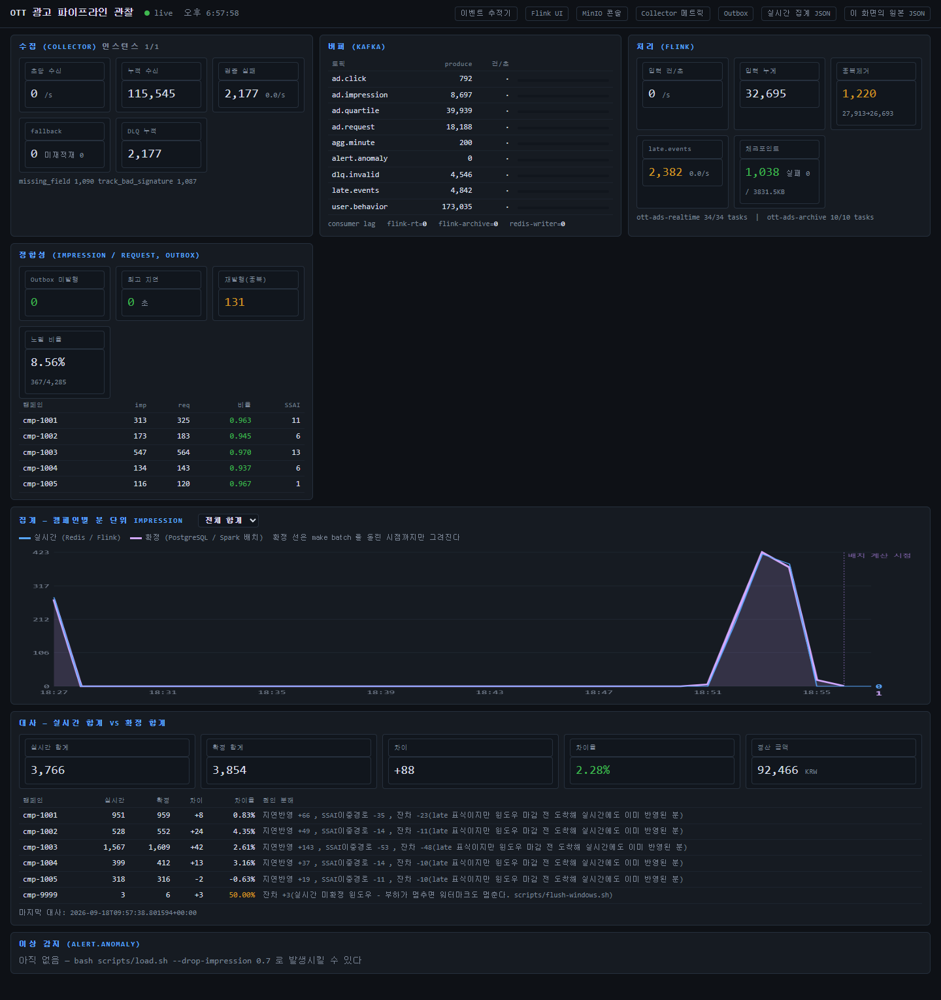
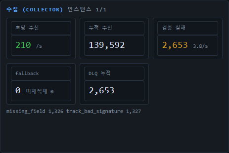
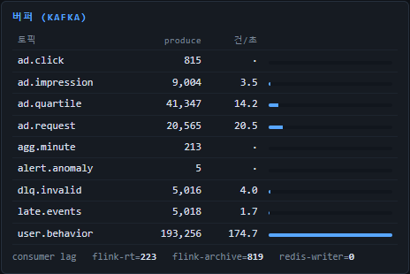
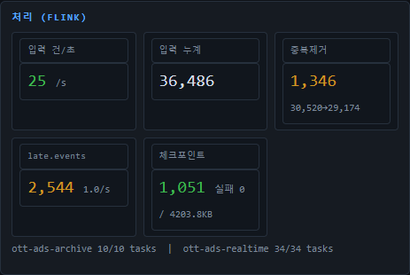
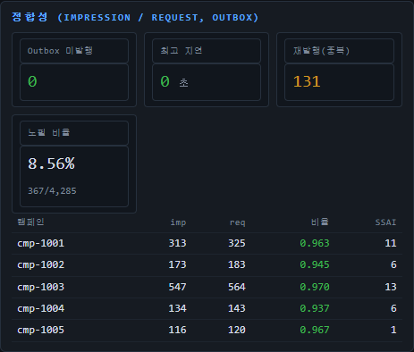
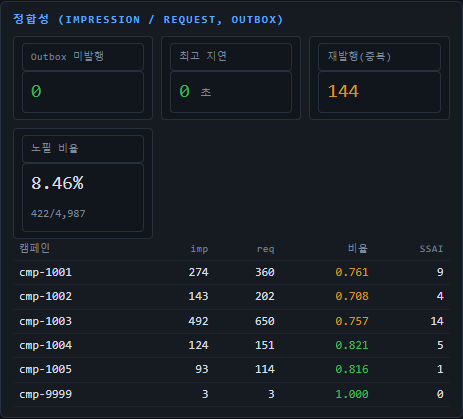
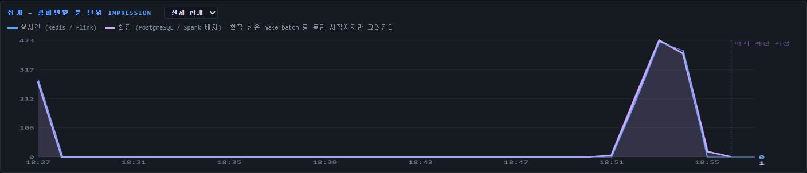
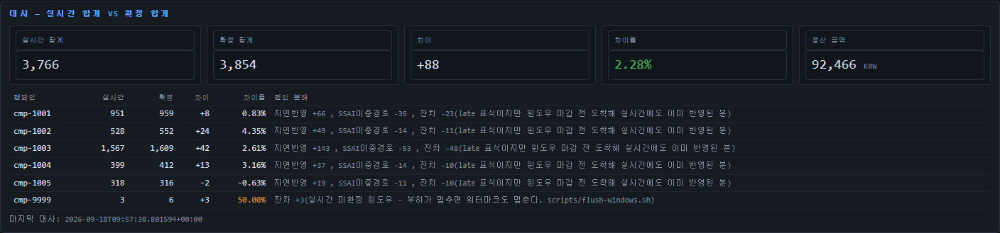
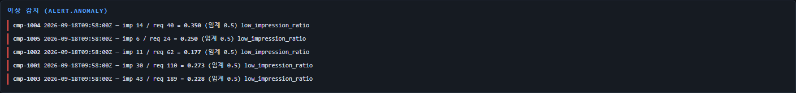

# 09. 관찰 대시보드(:8088) 읽는 법

대시보드는 **파이프라인 전체가 지금 얼마나, 제대로 흐르는지**를 한 화면에 모은 것이다.
플레이어(:3001)가 "광고 1편" 을, 추적기(:3000)가 "이벤트 1건" 을 따라간다면 이 화면은 **전체 흐름**을 본다.

- 주소: http://localhost:8088 (1초마다 갱신)
- 코드: [`dashboard/api.py`](../dashboard/api.py)(수집), [`dashboard/index.html`](../dashboard/index.html)(화면)
- 캡처는 실제 화면이다. 부하 중(상단 패널), 배치·대사 후(전체), 임프레션 유실 사고 중(정합성·경고) 세 시점에서 찍었다.

---

## 1. 화면 전체 — 위에서 아래가 곧 파이프라인 순서



```
┌ 수집(Collector) ┐┌ 버퍼(Kafka) ┐┌ 처리(Flink) ┐     ← 이벤트가 들어와서 흘러가는 구간
└ 정합성(imp/req, Outbox) ┘                         ← 서버 확정 사실과 맞는가
└ 집계 그래프 (실시간 선 vs 확정 선) ────────────┘    ← 분 단위로 얼마나
└ 대사 (실시간 합계 vs 확정 합계) ───────────────┘    ← 두 숫자가 왜 다른가
└ 이상 감지 (alert.anomaly) ─────────────────────┘    ← 지금 사고가 났나
```

헤더의 `● live` 가 초록이면 API 가 응답하고 있다는 뜻이다. 빨강 + "API 연결 실패" 면 대시보드 컨테이너부터 본다.
오른쪽 링크는 각 원천 화면(추적기 · Flink UI · MinIO · Collector 메트릭 · Outbox · Redis 집계 JSON · 이 화면의 원본 JSON)으로 간다.

### 숫자는 어디서 오나

브라우저가 원천을 직접 긁지 않는다. `api.py` 의 백그라운드 샘플러가 1초마다 스냅샷을 만들고 화면은 그것만 받는다.

| 패널 | 원천 | 갱신 |
|---|---|---|
| 수집 | Collector `/actuator/prometheus` (복제본 전부 합산) | 1초 |
| 버퍼 | Kafka Admin API (토픽 끝 오프셋, 컨슈머 그룹 오프셋) | 3초 |
| 처리 | Flink REST `/jobs/<id>`, `/checkpoints` | **Flink 가 10초마다만 갱신** |
| 정합성 | ad-decision `/actuator/prometheus` + Redis 분집계 | 1초 |
| 그래프 | Redis(실시간) + PostgreSQL `minute_settlement`(확정) | 1초 / 배치 실행 시 |
| 대사 | PostgreSQL `reconciliation`, `daily_settlement` | **`recon.sh` 실행 시** |
| 이상 감지 | Redis `alerts:recent` (← Flink `alert.anomaly`) | 1초 |

**"누적" 숫자들은 기준이 제각각이다.** Collector·ad-decision 카운터는 **컨테이너가 뜬 뒤부터**,
Kafka `produce` 는 **토픽이 생긴 뒤부터**, Flink 는 **잡이 제출된 뒤부터** 센다.
그래서 서로 맞지 않아도 정상이다. 패널 사이 비교는 **초당 값(건/초)** 으로 한다.

---

## 2. 수집 (Collector)



| 칸 | 뜻 | 정상 / 이상 |
|---|---|---|
| 인스턴스 `1/1` | 살아 있는 Collector / 전체 복제본 | 분자 < 분모면 죽은 인스턴스가 있다 |
| **초당 수신** | 최근 8초 평균 수신 건/초 (배치 + 픽셀) | 부하 중 수백. 0이면 생산자가 없다 |
| 누적 수신 | 컨테이너 기동 이후 합 | |
| **검증 실패** | 필수 필드 누락·서명 위조 등으로 거른 건수와 초당 값 | 0이 아닌 게 정상 (생성기가 일부러 1%씩 섞는다). 급증하면 SDK 배포 사고나 위조 공격 |
| **fallback** | Kafka 발행에 실패해 로컬 파일로 흘린 건수 / **미재적재** | **미재적재 > 0 이면 빨강** — Kafka 장애가 있었고 아직 복구 안 된 데이터가 있다 |
| DLQ 누적 | `dlq.invalid` 로 보낸 건수 | **검증 실패와 항상 같아야 한다.** 다르면 DLQ 발행 자체가 실패하고 있다 |

아래 줄 `missing_field 1,326  track_bad_signature 1,327` 은 **검증 실패의 사유별 분해**다.
`missing_field` 는 SDK 버그, `track_bad_signature` 는 픽셀 위조로 읽는다.

---

## 3. 버퍼 (Kafka)



| 칸 | 뜻 |
|---|---|
| produce | 토픽이 생긴 뒤 쓰인 총 건수 (파티션 끝 오프셋의 합) |
| 건/초 + 막대 | 최근 유입 속도. 막대는 가장 빠른 토픽 대비 비율 |
| **consumer lag** | 그룹별로 "아직 못 읽은 건수". **1,000 을 넘으면 빨강** |

읽는 포인트:

- **`user.behavior` 막대가 가장 길다.** 전체의 약 63% 가 시청 행동(progress 등)이다.
  실시간 잡은 이 토픽을 안 읽는다 — 토픽을 나눈 이유가 이것이다 ([05](05-kafka-guide.md) 6장).
- **Flink 그룹(`flink-rt`, `flink-archive`)의 랙은 톱니 모양으로 오르내리는 게 정상이다.**
  Flink 는 오프셋을 **체크포인트(10초) 때만** 커밋하므로, 랙은 0 ~ "10초 분량" 사이를 왕복한다.
  캡처의 `flink-archive=819` 가 그 경우다(behavior 포함 초당 200건 × 몇 초). **계속 늘기만 하면** 그때가 문제다.
- `redis-writer` 는 자동 커밋이라 거의 0 이다.
- `alert.anomaly`, `late.events` 는 Flink 가 **쓰는** 토픽이다. 여기에 건/초가 보이면 경고나 지각이 발생 중이라는 뜻이다.

---

## 4. 처리 (Flink)



| 칸 | 뜻 | 읽는 법 |
|---|---|---|
| **입력 건/초** | 실시간 잡이 Kafka 에서 읽는 속도 | **수집 초당 수신보다 훨씬 작은 게 정상.** 실시간 잡은 광고 4개 토픽만 읽고 `user.behavior`(대부분)와 검증 실패분은 안 읽는다 |
| 입력 누계 | 잡 제출 후 읽은 합 | |
| **중복제거** | `Deduplicate` 연산자가 걸러낸 건수, `in→out` | 생성기 재전송(5%) + Outbox 재발행이 여기서 접힌다 |
| **late.events** | 워터마크를 지나 도착해 실시간 윈도우가 버린 건수, 초당 값 | 0이 아닌 게 정상(생성기가 10%를 30~60초 늦게 보낸다). 급증하면 네트워크 장애 후 밀린 전송 |
| **체크포인트** | 완료 수 · 실패 수 · 상태 크기 | 실패 > 0 이면 빨강. 상태 크기는 트래픽에 비례해 커진다 (캡처 4.2 MB = 중복제거용 `event_id` 1시간치) |
| 아래 줄 | 실행 중인 잡과 태스크 수 | 비어 있으면 빨강 문구 — `bash scripts/flink-submit.sh` |

**숫자가 계단식으로 움직인다.** Flink REST 가 연산자 지표를 10초마다만 갱신하기 때문이다.
그래서 초당 값은 24초 평균으로 계산한다. 1초마다 흔들리지 않는 것은 고장이 아니다.

> 이번에 고친 것: 예전에는 "입력" 에 archive 잡도 더했는데, archive 잡은 체이닝으로 박스가 합쳐져 있어
> 그 박스의 출력이 **이벤트가 아니라 체크포인트 커밋 신호**(체크포인트 1회당 5건)였다. 그래서 입력이 약 16% 부풀려져 있었다.
> 지금은 실시간 잡의 소스만 센다 ([`api.py`](../dashboard/api.py) `sample_flink`). 박스 읽는 법은 [07](07-flink-guide.md) 3절.

---

## 5. 정합성 (impression / request, Outbox)

평상시와 사고 중을 나란히 놓고 보면 읽는 법이 분명해진다.

| 평상시 (부하 후) | 사고 중 (임프레션 70% 유실) |
|---|---|
|  |  |

위쪽 카드 — **Outbox 경로의 건강 상태**

| 칸 | 뜻 | 색 기준 |
|---|---|---|
| **Outbox 미발행** | DB 에 들어갔지만 아직 Kafka 로 못 나간 `ad_response` 수 | 0 초록 · 1~100 주황 · **100 초과 빨강** |
| 최고 지연 | 가장 오래된 미발행 행의 나이(초) | 5초 초과 주황 · **30초 초과 빨강** |
| **재발행(중복)** | 발행 후 플래그 업데이트에 실패해 **다시 발행된** 건수 | 0이 아닌 게 정상 (`OUTBOX_UPDATE_FAIL_RATE=0.02` 로 일부러 만든다) |
| 노필 비율 | 광고 요청 중 채우지 못한 비율 (`노필/전체`) | `AD_NO_FILL_RATE=0.08` 근처면 정상 |

아래 표 — **캠페인별 impression / request (최근 30분, Redis 실시간 합계)**

| 열 | 뜻 |
|---|---|
| imp | 실시간 집계된 임프레션 (`event_id` 중복만 제거, SSAI 는 안 뺌) |
| req | **서버가 확정해 실제로 채운** 광고 요청 (`ad_response AND fill=true`) |
| **비율** | imp ÷ req. 광고를 내보내기로 한 것 중 실제 화면에 뜬 비율. **0.8 이상 초록 · 0.5~0.8 주황 · 0.5 미만 빨강** |
| SSAI | 서버 경로로 한 번 더 온 임프레션 수 |

읽는 포인트:

- **평상시 비율은 0.9~0.97** 이다. 1보다 약간 작은 이유는 광고 도중 이탈·지각 이벤트 때문이다.
- **비율이 1을 넘을 수도 있다.** SSAI 이중경로는 `event_id` 가 달라 실시간이 둘 다 세기 때문이다. 이때 SSAI 칸이 같이 크다.
- **사고 중에도 표는 0.71~0.82 로 "주황" 에 그친다.** 30분 누적이라 사고 이전 분들이 섞여 **희석**되기 때문이다.
  같은 시각 경고 패널(9절)에서는 분 단위 비율이 **0.18~0.35** 였다. **사고 감지는 이 표가 아니라 경고 패널로 한다.**
- `cmp-9999` 는 [워터마크 밀기] 전용 캠페인이다. 무시한다.

---

## 6. 집계 그래프 — 실시간 선 vs 확정 선



| 선 | 뜻 |
|---|---|
| **파랑** (가는 선) | 실시간 — Redis 분집계 (Flink) |
| **보라** (굵은 선 + 면) | 확정 — PostgreSQL `minute_settlement` (Spark 배치) |
| 점선 "배치 계산 시점" | 배치가 계산한 마지막 분. 그 뒤로는 보라 선이 없다 |

읽는 포인트:

- **두 선이 겹치면** 그 분은 실시간과 확정이 같다. **갈라진 분**이 대사에서 설명해야 할 차이가 생긴 곳이다.
  보라가 위면 지각 이벤트(실시간이 놓침), 파랑이 위면 SSAI·장기중복(실시간이 과다 계상)이다.
- **가장 최근 1~2분의 파랑이 0 근처로 떨어지는 것은 정상이다.** 그 분의 윈도우가 아직 안 닫혔다(1분 + 워터마크 10초).
- 위 셀렉트 박스로 캠페인 하나만 볼 수 있다. 기본은 전체 합계.
- 보라 선이 아예 없으면 배치를 안 돌린 것이다 → `bash scripts/flush-windows.sh && bash scripts/batch.sh`.

---

## 7. 대사 — 실시간 합계 vs 확정 합계



위 카드 다섯 개는 **가장 최근 `recon.sh` 실행 결과**다 (아래 "마지막 대사" 시각). 실시간으로 바뀌지 않는다.

| 칸 | 캡처 값 | 뜻 |
|---|---|---|
| 실시간 합계 | 3,766 | 그날 Redis 분집계의 합 |
| 확정 합계 | 3,854 | 그날 `daily_settlement.impressions` 합 (중복·SSAI 정리 후) |
| 차이 / 차이율 | +88 / 2.28% | 확정 − 실시간. **5% 넘으면 주황** — 조사 대상 |
| 정산 금액 | 92,466 KRW | `daily_settlement.amount` 합 = 확정 임프레션 ÷ 1000 × CPM |

**원인 분해 열이 이 화면의 핵심이다.**

```
확정 = 실시간 + 지연반영 − SSAI이중경로 − 장기중복 (+ 잔차)

cmp-1003:  1,609 = 1,567 + 143 − 53 − 48
                          │     │     └ 잔차: late 표식이 붙었지만 윈도우 마감 전에 도착해 실시간에도 이미 들어간 분
                          │     └ SSAI: 실시간이 둘 다 셌고 배치는 하나만 채택
                          └ 지연반영: 실시간 윈도우가 버렸고(late.events) 배치는 셌다
```

- **차이가 0 이 아닌 게 정상이다.** 설명되지 않는 잔차가 크면 그때가 문제다.
- 정산은 **확정값**으로 한다. 실시간은 운영 모니터링용이다.
- `cmp-9999` 의 50% 는 워터마크 밀기용 몇 건이라 비율만 커 보이는 것이다. 무시한다.

**5절 표와 숫자가 다른 이유**: 정합성 표는 **최근 30분** 실시간 합계, 대사는 **하루 전체**(대사 실행 시점)다.

---

## 8. 이상 감지 (alert.anomaly)



```
cmp-1004  2026-09-18T09:58:00Z — imp 14 / req 40 = 0.350 (임계 0.5) low_impression_ratio
└ 캠페인   └ 윈도우 시작(UTC, 1분)   └ 그 1분의 imp / req = 비율     └ 경고 종류
```

Flink 가 **1분 윈도우마다** imp/req 비율을 계산해, `req ≥ 5` 이고 비율 `< 0.5` 면 발화한다
(`ALERT_MIN_REQUESTS`, `ALERT_THRESHOLD`). "서버는 광고를 내보냈는데 화면에는 안 떴다" —
광고 차단, 플레이어 오류, SSAI 스티칭 실패가 이 모양으로 나타난다.

평상시에는 비어 있고 "아직 없음" 이 정상이다. 재현: `bash scripts/load.sh --drop-impression 0.7`.

---

## 9. 상황별로 어디를 보나

| 증상 | 먼저 볼 칸 | 다음 행동 |
|---|---|---|
| 아무 숫자도 안 움직인다 | 수집 초당 수신 = 0 | 생산자가 없다. 플레이어 재생 또는 `bash scripts/load.sh` |
| 수집은 되는데 처리가 0 | 처리 아래 줄 (잡 없음) | `bash scripts/flink-submit.sh` |
| fallback 미재적재 > 0 | 수집 · 버퍼 | Kafka 장애. 복구 후 재적재 (README 8-2) |
| 컨슈머 랙이 계속 증가 | 버퍼 consumer lag | Flink UI BackPressure ([07](07-flink-guide.md) 6절) |
| 체크포인트 실패 증가 | 처리 체크포인트 | Flink UI Exceptions / Checkpoints |
| Outbox 미발행 증가 | 정합성 카드 | ad-decision 로그, Kafka 상태 |
| 비율이 주황/빨강 | 이상 감지 패널 | 해당 캠페인·분을 플레이어 [데이터 확인] 이나 원본에서 확인 |
| 그래프 최근 분이 계속 0 | — | 부하가 멈춰 워터마크가 멈춤. 정상 |
| 보라 선 / 대사가 비었다 | — | `flush-windows.sh` → `batch.sh` → `recon.sh` |
| 대사 차이율 > 5% | 원인 분해 | 잔차가 크면 조사. 지연·SSAI 로 설명되면 정상 |

"이 칸이 0 이면 고장인가?" 의 전체 판정표는 루트 [README 1-2절](../README.md) 에 있다.

---

## 10. 원본 JSON 으로 보기

화면의 모든 숫자는 http://localhost:8088/api/overview 한 번에 들어 있다. 스크립트에서 쓸 때 편하다.

| JSON 경로 | 화면 |
|---|---|
| `ingest.received_rate`, `ingest.invalid`, `ingest.by_reason`, `ingest.fallback_pending` | 수집 |
| `kafka.topics[]`, `kafka.groups` | 버퍼 |
| `flink.input_rate`, `flink.dedup_in/out`, `flink.late_out`, `flink.checkpoints` | 처리 |
| `outbox.unpublished`, `outbox.republished`, `outbox.fill/nofill`, `realtime.totals` | 정합성 |
| `realtime.series`, `batch.minute` | 그래프 |
| `batch.recon`, `batch.daily` | 대사 |
| `realtime.alerts` | 이상 감지 |

```bash
curl -s localhost:8088/api/overview | python -m json.tool | less
# 예: 중복제거 건수만
curl -s localhost:8088/api/overview | python -c "import sys,json; f=json.load(sys.stdin)['flink']; print(f['dedup_in'], '->', f['dedup_out'])"
```

같은 정보의 CLI 버전은 `bash scripts/observe.sh` (1초마다 한 줄).

---

## 11. 10분 실습

1. `bash scripts/load.sh` (기본 60초) → 수집 초당 수신, 버퍼 막대, 처리 입력이 차례로 오르는 것을 본다.
   **수집 수백/초 vs 처리 수십/초** 차이가 `user.behavior` 때문임을 버퍼 막대로 확인한다.
2. 부하가 끝나면 그래프 최근 분의 파랑이 0 근처에 멈춰 있는 것을 본다 → `bash scripts/flush-windows.sh` 후 올라온다.
3. `bash scripts/batch.sh && bash scripts/recon.sh` → 보라 선과 대사 패널이 채워진다. 원인 분해를 손으로 더해 확정값이 맞는지 확인한다.
4. `bash scripts/load.sh --drop-impression 0.7` → 1~2분 뒤 이상 감지 패널에 경고가 뜨고, 정합성 표 비율이 주황으로 내려간다.
   경고의 분 단위 비율과 표의 30분 누적 비율을 비교한다.
5. `bash scripts/scenario_kafka_down.sh` → fallback 미재적재가 빨강으로 오르고, 복구 후 0 으로 돌아오는 것을 본다.
