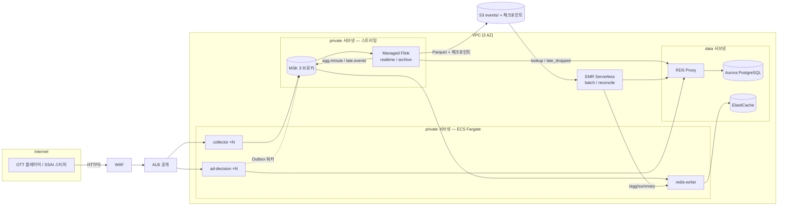

# 10. AWS 로 옮긴다면 — 이전 설계

이 문서는 **실제로 옮기지 않고, 옮기는 방법만** 적는다.
대상 규모는 [04-scale-100m.md](04-scale-100m.md) 의 **S1(일 1억 건, 피크 약 6,000 EPS)** 이다.
용량 숫자는 04 문서를 따르고, 여기서는 "어느 AWS 서비스에 무엇을 어떻게 올리나" 를 다룬다.

가격은 적지 않는다. 리전·약정·시점마다 달라서 숫자를 적으면 곧 틀린다.
대신 **비용이 어디서 새는지**(7절)를 적었다. 실제 견적은 AWS Pricing Calculator 로 낸다.

2~9절은 관리형 중심 추천안이다. 비용을 우선하는 대안은 **10절**, ECS 대신 EC2 로 운영하는 안과 그 네트워크 구성은 **11~12절**에 있다.

---

## 1. 원칙 — 무엇을 지키고 무엇을 바꾸나

**지키는 것 (계약)** — 이게 바뀌면 이전이 아니라 재개발이다.

| 계약 | 지금 | AWS 에서도 |
|---|---|---|
| 이벤트 스키마 | [02-data-stores.md](02-data-stores.md) 2장 | 그대로 |
| 토픽 이름·파티션 키 | `ad.*`, 키 = `ad_request_id` | 그대로 (Kafka 를 유지하는 이유) |
| 수집 API | `POST /v1/events`, `GET /v1/track`(HMAC), 항상 202 / 1x1 GIF | 그대로 |
| 광고 결정 API | `POST /v1/ad-request` + Outbox | 그대로 |
| Flink SQL | `sql/pipeline.sql`, `sql/archive.sql` | 접속 정보만 자리표시자로 |
| 배치·대사 | `spark/*.py` (멱등, 구간 대사) | 저장소 경로만 바꿈 |

**바꾸는 것** — 전부 "직접 운영하던 것을 관리형으로" 다.

**Kafka 를 Kinesis 로 바꾸지 않는다.** Kinesis 도 가능하지만 파티션 키·오프셋·컨슈머 그룹 모델이 달라서
Collector, Flink 소스, 추적기의 Kafka 스캔, redis-writer 를 모두 다시 써야 한다. MSK 는 코드를 거의 안 건드린다.

---

## 2. 컴포넌트 대응표

| 지금 (docker compose) | AWS | 고른 이유 / 대안 |
|---|---|---|
| **collector** (Spring WebFlux) | **ECS Fargate** + ALB (공개) + WAF | 상태 없음 → 컨테이너 그대로. RPS·CPU 로 오토스케일. 대안: EKS |
| **ad-decision** (Spring MVC + Outbox 워커) | **ECS Fargate** + ALB | Outbox 는 이미 `SKIP LOCKED` 라 태스크를 여러 개 띄워도 된다. S2 에서는 CDC 로 교체(아래) |
| **Kafka** (KRaft 1대) | **Amazon MSK** (Provisioned, 3 AZ) | 토픽·키 모델 유지. 소규모 시작은 MSK Serverless 도 가능 (IAM 인증 필수) |
| **Flink** (JM 1 + TM 1, SQL Client) | **Amazon Managed Service for Apache Flink** | 체크포인트·복구·스케일을 AWS 가 맡는다. 대안: EKS + Flink Kubernetes Operator |
| **redis-writer** | ECS Fargate (작은 태스크 1~2개) | 대안: MSK 이벤트 소스 매핑 Lambda. 코드가 짧아 옮기기 쉽다 |
| **Redis** | **ElastiCache** (Valkey/Redis OSS, 기본 1 + 복제 1) | 실시간 서빙용 캐시라 영속성 불필요 — 지금 설정과 같다 |
| **MinIO** | **S3** | s3a 가 원래 S3 용이다. 엔드포인트·path-style 설정만 뺀다 |
| **Spark** (on-demand 컨테이너) | **EMR Serverless** (Spark 3.5) | 배치를 돌릴 때만 과금. 대안: AWS Glue 잡 |
| 배치 실행 (사람이 `make batch`) | **EventBridge Scheduler → Step Functions** | 배치 → 대사 순서와 실패 재시도를 상태 머신으로. 대안: MWAA(Airflow) |
| **Postgres** | **Aurora PostgreSQL** (Multi-AZ) + **RDS Proxy** | RDS Proxy 가 04 문서의 PgBouncer 역할. `SKIP LOCKED`·upsert 그대로 동작 |
| **dashboard** (FastAPI) | ECS (내부 ALB + 사내 인증) 또는 **Managed Grafana** 로 교체 | 운영에서는 Grafana + Prometheus 가 표준. 이 대시보드는 관찰용 데모 |
| **player / tracer / generator** | 운영에 올리지 않는다 | 스테이징에서만. generator 는 부하 시험용 ECS 태스크로 |
| `.env` | **Secrets Manager** + SSM Parameter Store | HMAC 키·DB 비밀번호는 Secrets Manager (교체 주기), 나머지는 Parameter Store |
| `make` / 수동 배포 | **배포 파이프라인 (예: GitHub Actions OIDC 또는 CodePipeline) → ECR → ECS**, IaC 는 Terraform 또는 CDK | 지금 저장소에는 CI 가 없으니 새로 만든다. 로컬의 `make check`·`make e2e` 를 단계로 옮긴다 |

---

## 3. 목표 구조



네트워크에서 챙길 것:

- **서브넷 3층**: public(ALB, NAT) / private(ECS, MSK, Flink) / data(Aurora, ElastiCache). 보안 그룹은 "누가 누구를 부르나" 대로만 연다.
- **S3 는 게이트웨이 VPC 엔드포인트로.** 안 그러면 Flink 가 쓰는 Parquet·체크포인트가 전부 NAT 게이트웨이를 지나며 처리 비용이 붙는다.
- ECR, Secrets Manager, CloudWatch Logs 도 **인터페이스 엔드포인트**를 두면 NAT 를 안 탄다.
- 광고 결정 API 는 플레이어가 직접 부르므로 공개 ALB 뒤에 둔다. 경로 기반 라우팅으로 `/v1/events`·`/v1/track` → collector, `/v1/ad-request` → ad-decision.

---

## 4. 컴포넌트별 이전 방법

### 4-1. collector

- 이미지를 ECR 에 올리고 ECS 서비스로 띄운다. 헬스 체크는 지금 있는 `/actuator/health`.
- 오토스케일: ALB 대상당 요청 수(`RequestCountPerTarget`) 기준. 04 문서 실측 1 인스턴스 약 2,000 EPS → S1 피크 6,000 EPS 면 최소 4~6 태스크.
- **fail-open 파일(`data/fallback`)이 문제다.** Fargate 의 임시 저장소는 태스크가 죽으면 사라진다.
  - 1안: 폴백 JSONL 을 주기적으로 S3 에 올리는 사이드카 (재적재는 지금처럼 배치로)
  - 2안: 폴백 경로를 Kinesis Data Firehose → S3 로 (Kafka 가 죽었을 때만 쓰는 두 번째 경로)
- HMAC 키: Secrets Manager 에 두고 ECS 태스크 정의의 `secrets` 로 `COLLECTOR_HMAC_SECRET` 에 주입.
- Kafka 접속: MSK IAM 인증을 쓰면 `aws-msk-iam-auth` 라이브러리와 `security.protocol=SASL_SSL`,
  `sasl.mechanism=AWS_MSK_IAM` 설정이 필요하다. 태스크 역할에 토픽 쓰기 권한을 준다.

### 4-2. ad-decision (+ Outbox)

- ECS 서비스로 띄운다. **Outbox 워커가 같은 프로세스에 들어 있으므로** 태스크 수 = 워커 인스턴스 수가 된다.
  조회에 `FOR UPDATE SKIP LOCKED` 가 이미 있어서 태스크를 늘려도 중복 발행이 늘지 않는다 (README 4-2 실측).
- 규모가 커지면 워커를 별도 서비스로 떼어 API 와 따로 스케일한다 (`OUTBOX_WORKERS`).
- S2 수준이면 폴링 대신 **Debezium(MSK Connect) CDC** 로 바꾼다. Aurora 의 논리 복제(`rds.logical_replication=1`)를 켜야 한다.
- DB 연결은 RDS Proxy 로. 태스크가 늘어도 Aurora 커넥션이 폭증하지 않는다.

### 4-3. Kafka → MSK

- 3 AZ 에 브로커 3대 (S1 은 소형 인스턴스로 시작, 04 문서 3-2 의 처리량 계산 참고).
- 토픽 설정은 [`kafka/create-topics.sh`](../kafka/create-topics.sh) 를 그대로 옮긴다: 파티션 48(S1), `replication.factor=3`,
  **`min.insync.replicas=2`**, 자동 생성 끔(`auto.create.topics.enable=false`, MSK 구성으로 지정).
- 인증: IAM 을 권장한다 (자격 증명을 코드에 안 둔다). 대안은 SASL/SCRAM + Secrets Manager.
- 컨슈머에 `client.rack` 을 AZ ID 로 주면 **가까운 복제본에서 읽어**(follower fetching) AZ 간 전송이 줄어든다.

### 4-4. Flink → Managed Service for Apache Flink

가장 손이 많이 가는 곳이다. **지금은 SQL Client 로 `.sql` 파일을 제출**하는데, 관리형 Flink 는
**애플리케이션(JAR 또는 PyFlink)** 을 받는다.

- 얇은 래퍼 애플리케이션을 하나 만든다: `pipeline.sql` 을 읽어 자리표시자를 치환하고
  `TableEnvironment.executeSql()` 로 문장을 차례로 실행한다 (마지막의 `EXECUTE STATEMENT SET` 까지).
  SQL 자체는 그대로 쓴다. 치환 값은 애플리케이션 런타임 속성에서 받는다.
- 지금 SQL 에 박혀 있는 접속 정보를 **자리표시자로** 바꿔야 한다:

  | 파일 | 지금 | 바꿀 것 |
  |---|---|---|
  | `sql/pipeline.sql`, `sql/archive.sql` | `'properties.bootstrap.servers' = 'kafka:9092'` | MSK 부트스트랩 + IAM 인증 속성 |
  | `sql/pipeline.sql` (`campaigns`, `late_dropped_sink`) | `jdbc:postgresql://postgres:5432/...`, `'ads'/'ads'` | RDS Proxy 엔드포인트, 자격 증명은 Secrets Manager |
  | `sql/archive.sql` | `'path' = 's3a://events/'` | `s3://<버킷>/events/` |
  | `docker-compose.yml` Flink 설정 | `state.checkpoints.dir: file:///data/checkpoints`, `s3.endpoint: http://minio:9000` | 관리형 Flink 는 체크포인트를 자체 관리 (S3 엔드포인트 설정 삭제) |

- 커넥터 JAR(`flink-sql-connector-kafka`, `flink-connector-jdbc`, PostgreSQL 드라이버, `aws-msk-iam-auth`)는
  애플리케이션 패키지에 함께 넣는다. **관리형 Flink 가 지원하는 Flink 버전을 먼저 확인**하고,
  1.20 이 없으면 커넥터를 그 버전 접미사(예: `-1.19`)로 맞춘다 (flink/Dockerfile 의 버전 고정 원칙 그대로).
- 상태 백엔드는 RocksDB 가 기본이다. 04 문서의 "중복제거 상태 S1 약 400 MB" 는 여유 있게 들어간다.
- 병렬도: 소스 파티션 48 에 맞춰 올린다. 체이닝(`pipeline.operator-chaining`)은 **켠다** — 관찰용으로 꺼 둔 것이다.
- 스냅샷 기반 업데이트: 잡을 바꿀 때 스냅샷에서 이어서 시작한다. SQL 이 바뀌면 상태가 호환되지 않을 수 있으니
  (연산자 모양이 바뀜) 그때는 새 상태로 시작하고 **대사로 공백 구간을 확인**한다.
- 대안인 **EKS + Flink Kubernetes Operator** 는 SQL Client·세션 클러스터 방식을 거의 그대로 쓸 수 있지만
  쿠버네티스 운영을 떠안는다. 팀에 쿠버네티스 운영 경험이 있으면 고려한다.

### 4-5. redis-writer + ElastiCache

- redis-writer 는 ECS 태스크 1~2개면 된다 (`agg.minute` 은 분당 캠페인 수만큼). 컨슈머 그룹이라 2개를 띄워도 나눠 읽는다.
- ElastiCache 는 **영속성 없이**, 지금처럼 TTL(48h)과 `volatile-ttl` 정책을 둔다. Redis 가 날아가도 `agg.minute` 을 다시 읽으면 복구된다.
- 대사가 쓰는 `/agg/summary` 는 redis-writer 가 제공하므로 EMR 에서 redis-writer 로 가는 경로(내부 ALB 또는 서비스 디스커버리)를 연다.

### 4-6. MinIO → S3

- 버킷 하나에 `events/dt=/hour=/` 경로를 그대로 쓴다.
- Spark 설정([`spark/common.py`](../spark/common.py))에서 MinIO 전용 설정을 뺀다:
  `fs.s3a.endpoint`, `path.style.access`, `connection.ssl.enabled=false`, `SimpleAWSCredentialsProvider`(키 직접 지정).
  EMR 에서는 인스턴스 역할로 인증하고 경로는 `s3://` 를 쓴다.
- **라이프사이클**: 원본은 30일 뒤 저빈도 접근(IA), 1년 뒤 Glacier (보존 기간은 정산·감사 정책에 맞춘다).
- 04 문서의 small files 대책을 여기서 적용한다: archive 체크포인트 1~5분 + 컴팩션, 또는 **Iceberg + Glue Data Catalog**.
  S3 는 요청 수로도 과금하므로 파일이 잘게 쪼개지면 PUT/GET 비용이 늘어난다 (7절).

### 4-7. Spark → EMR Serverless + 스케줄

- `spark/batch_settlement.py`, `reconcile.py` 는 그대로 제출한다 (`common.py` 의 S3·JDBC 설정만 교체).
- 스케줄: EventBridge Scheduler 가 매시/매일 Step Functions 를 깨우고, 상태 머신이
  `배치 → 대사` 를 순서대로 돌린다. 대사는 **구간 대사**(`RECON_FROM`/`RECON_TO`)로 방금 닫힌 구간만 본다.
- 04 문서대로 배치를 전체 재계산에서 **`dt` 증분 + 파티션 교체**로 바꾸는 것이 전제다 (S3 원본이 쌓일수록 전체 재계산은 못 버틴다).
- 대사 결과의 잔차가 0 이 아니면 Step Functions 에서 SNS 로 알린다. 이게 운영의 "숫자가 맞나" 경보가 된다.

### 4-8. PostgreSQL → Aurora

- 스키마는 [`postgres/init/`](../postgres/init/) 두 파일을 마이그레이션 도구(Flyway 등)로 옮긴다.
  배치가 런타임에 하는 `ALTER TABLE ... IF NOT EXISTS` 는 마이그레이션 파일로 끌어올린다.
- `event_outbox` 는 계속 커지므로 04 문서대로 **발행 완료 7일 뒤 삭제 + 파티셔닝**을 붙인다.
- `late_dropped` 도 같은 방식으로 보존 기간을 둔다. 지각이 매우 많으면 04 문서대로 `late.events` 를 S3 로 옮겨 읽는다.

### 4-9. 관측

| 지금 | AWS |
|---|---|
| 대시보드(:8088) 수집·버퍼·처리 패널 | CloudWatch (MSK·ECS·Flink 지표) + **Managed Grafana** |
| `/actuator/prometheus` (collector, ad-decision) | **Amazon Managed Service for Prometheus** 가 수집 |
| 컨슈머 랙 (대시보드 버퍼 패널) | MSK 의 `MaxOffsetLag` 지표, 또는 Burrow/Kafka Exporter |
| 대사 표 | Aurora `reconciliation` 을 Grafana 에서 조회 + 잔차 경보 |
| 컨테이너 로그 | CloudWatch Logs (보존 기간 지정 — 기본은 무기한이라 비용이 샌다) |

---

## 5. 옮기는 순서

**이 저장소처럼 아직 운영 트래픽이 없다면** 1~4 를 순서대로 올리고 E2E(6절)로 확인하면 끝이다.
**이미 온프레미스에서 운영 중이라면** 5 가 핵심이다 — 두 환경을 나란히 돌리고 숫자가 같은지 대사로 확인한 뒤 넘어간다.

| 단계 | 내용 | 끝났다는 기준 |
|---|---|---|
| 0. 바닥 | 계정·VPC·서브넷·엔드포인트·IAM·ECR, IaC 로 | `terraform plan` 이 깨끗하다 |
| 1. 저장 계층 | S3, Aurora(스키마), ElastiCache, MSK(토픽) | 각 엔드포인트에 스테이징에서 접속된다 |
| 2. 상태 없는 서비스 | collector, ad-decision, redis-writer (ECS) | `/actuator/health` UP, 스모크 이벤트가 토픽에 들어간다 |
| 3. Flink | realtime / archive 애플리케이션 | 체크포인트 성공, `agg.minute`·S3 Parquet 생성 |
| 4. 배치·대사 | EMR Serverless + Step Functions | 구간 대사 잔차 0 |
| 5. 병행 운영 | 아래 | 며칠간 두 환경의 확정 집계가 일치 |
| 6. 전환 | DNS 가중치로 수집 트래픽을 AWS 로 | 옛 환경 수집 0 |
| 7. 정리 | 옛 환경 종료, 원본 아카이브 이관 | |

**5. 병행 운영 — 이 프로젝트의 대사 도구가 그대로 쓰인다.**

1. **MirrorMaker 2**(또는 MSK Replicator)로 온프레미스 Kafka 의 `ad.*` 토픽을 MSK 로 복제한다.
   복제 중에는 AWS 쪽 collector 는 트래픽을 받지 않는다.
2. AWS 쪽 Flink·배치를 복제된 토픽으로 돌린다. 이제 같은 이벤트가 두 환경에서 처리된다.
3. 같은 구간을 두 환경에서 대사한다 (`RECON_FROM`/`RECON_TO`). **확정 집계가 캠페인별로 같아야 한다.**
   다르면 원인은 대개 접속 설정(시간대, 커넥터 버전) 이다 — 이전 전에 잡는다.
4. 수집 전환은 DNS 가중치(Route 53)로 1% → 10% → 50% → 100%. collector 는 어느 쪽이든 같은 토픽 이름에 쓰므로
   전환 중에는 **MirrorMaker 방향을 끊고** AWS MSK 를 기준으로 삼는 시점을 한 번 정한다 (그 분을 기록해 두고 대사 구간 경계로 쓴다).
5. Outbox 는 DB 가 옮겨 가야 하므로 가장 마지막이다. Aurora 로 논리 복제(AWS DMS)한 뒤 짧은 쓰기 중지 구간에서 전환한다.
   전환 순간의 재발행 중복은 at-least-once 설계상 뒤에서 걸러진다 — 이 설계가 이전을 쉽게 만드는 지점이다.

---

## 6. AWS 에서 E2E 돌리기

[`scripts/e2e.sh`](../scripts/e2e.sh) 는 docker compose 를 전제로 하지만, 검사 본체
[`tests/e2e/pipeline_checks.py`](../tests/e2e/pipeline_checks.py) 는 **접속 정보를 환경변수로만** 받는다
(`COLLECTOR_URL`, `AD_DECISION_URL`, `KAFKA_BOOTSTRAP`, `REDIS_HOST`, `PG_HOST`, `MINIO_*`).

- 스테이징 VPC 안에서 tracer 이미지로 **ECS 1회성 태스크**를 띄워 `send` → (배치·대사) → `check` 를 실행한다.
- 바꿀 곳: MinIO 조회를 S3 로(`pyarrow.fs.S3FileSystem` 에서 엔드포인트를 빼고 역할 자격 증명), Kafka 는 IAM 인증 속성 추가.
- 배경 부하는 generator 이미지를 ECS 태스크로 돌리고, 배치·대사는 Step Functions 를 직접 실행한다.
- 배포 파이프라인에서 **스테이징 E2E 통과를 운영 배포의 조건**으로 건다.

---

## 7. 비용이 새는 곳

금액 대신 "무엇이 비용을 만드나" 만 적는다. 설계 단계에서 이것만 피해도 큰 차이가 난다.

| 새는 곳 | 왜 | 막는 법 |
|---|---|---|
| **NAT 게이트웨이 처리량** | private 서브넷에서 S3·ECR·CloudWatch 로 가는 트래픽이 NAT 를 지나면 GB 당 과금 | S3 게이트웨이 엔드포인트, 나머지 인터페이스 엔드포인트 |
| **AZ 간 전송** | 클라이언트가 다른 AZ 의 브로커·DB 를 읽으면 GB 당 과금 (MSK 브로커 간 복제는 별도 과금 없음) | `client.rack` 으로 가까운 복제본 읽기, 같은 AZ 배치 |
| **S3 요청 수** | Parquet 이 10초마다 잘게 쪼개지면 PUT·GET·LIST 가 폭증 (04 문서: S1 하루 86만 파일) | 체크포인트 간격↑, 컴팩션, Iceberg |
| **관리형 Flink 처리 단위** | 병렬도 × 시간으로 과금. 관찰용 비체이닝 설정은 연산자 수만큼 자원을 먹는다 | 체이닝 켜기, 병렬도를 파티션 수에 맞추기 |
| **MSK 스토리지** | 보존 7일 × RF3 = 04 문서 약 190 GB | 보존 기간을 요구사항에 맞춤, 오래된 건 S3 원본으로 |
| **CloudWatch Logs** | 기본 보존이 무기한, 수집량 과금 | 로그 그룹마다 보존 기간 설정, DEBUG 끄기 |
| **상시 켜진 스테이징** | 운영과 같은 구성을 24시간 | 스테이징은 E2E 때만 올리는 IaC 로 |

---

## 8. 걸리기 쉬운 함정

| 함정 | 증상 | 대응 |
|---|---|---|
| MSK IAM 인증 라이브러리 누락 | 클라이언트가 접속 직후 인증 오류 | Collector·Flink·redis-writer·Outbox 워커 모두에 `aws-msk-iam-auth` 와 SASL 설정 |
| Flink 커넥터 버전 불일치 | 잡이 뜨자마자 `ClassNotFound` / `NoSuchMethod` | 관리형 Flink 버전 접미사에 맞춘 커넥터 (flink/Dockerfile 주석의 원칙) |
| 시간대 | 대사에서 분 단위가 어긋남 | Flink `table.local-time-zone=UTC`, Spark `session.timeZone=UTC`, `late_dropped` 는 UTC TIMESTAMP — 그대로 유지 |
| Fargate 임시 저장소 | 태스크 재시작 시 collector 폴백 파일 유실 | 4-1 의 사이드카 또는 Firehose |
| RDS Proxy 없이 태스크 증가 | Aurora `too many connections` | RDS Proxy, 태스크별 풀 크기 제한 |
| 토픽 자동 생성 | 오타 난 토픽이 조용히 생김 | MSK 구성에서 `auto.create.topics.enable=false` (지금 로컬과 같게) |
| ALB 가 픽셀 응답을 느리게 | 플레이어 재시도 폭주 | collector 는 항상 즉시 200 + GIF (지금 계약 유지), ALB 헬스 체크는 별도 경로 |
| SQL 변경 후 스냅샷 복구 실패 | 잡이 스냅샷에서 못 뜸 | 새 상태로 시작 + 공백 구간 구간 대사, 또는 연산자 UID 고정 |
| 비밀값을 이미지에 굽기 | 이미지 유출 = 키 유출 | Secrets Manager 주입만. `.env.example` 은 로컬 전용 |
| 컨테이너 사용자와 볼륨 권한 | 비 root 컨테이너가 마운트 경로에 못 씀 | 이 저장소를 Linux 에서 돌릴 때 실제로 겪었다 (Linux 에서 Flink 체크포인트 폴더 생성 실패 → `data-init`). ECS 에서 EFS 등을 붙일 때는 접근 포인트의 uid/gid 를 컨테이너 사용자에 맞춘다 |

---

## 9. 코드에서 바꿀 자리 요약

| 파일 | 바꿀 것 |
|---|---|
| `sql/pipeline.sql`, `sql/archive.sql` | Kafka·JDBC·S3 접속 정보를 `__KAFKA_BOOTSTRAP__` 같은 자리표시자로 (지금 `flink-submit.sh` 가 쓰는 방식과 같게) |
| (신규) Flink 래퍼 앱 | SQL 파일 읽기 → 치환 → `executeSql` 순서 실행 |
| `spark/common.py` | MinIO 전용 s3a 설정 제거, `s3://` 경로, 역할 인증 |
| collector / ad-decision `application.yml` | Kafka SASL/IAM 속성, DB 는 RDS Proxy |
| `redis-writer/writer.py`, `dashboard/api.py` | Kafka IAM 속성 |
| `postgres/init/*.sql` + 배치의 `ALTER` | 마이그레이션 도구로 이관 |
| `docker-compose.yml` | 로컬 개발용으로 남긴다. 운영 정의는 IaC (Terraform/CDK) |
| (신규) 배포 파이프라인 | ECR 푸시·ECS 배포·스테이징 E2E (OIDC 로 AWS 인증) |

바꾸지 않는 것: 이벤트 스키마, 토픽 이름·키, Flink SQL 의 로직, 배치·대사 로직, Outbox, 멱등 처리.
**로컬에서 관찰한 성질(중복·지각·SSAI·Outbox 재발행)은 AWS 에서도 그대로 나타난다.**
그래서 대사 도구와 E2E 가 이전의 안전망이 된다.

---

## 10. 비용 기준 대안

위 추천안(관리형 중심)은 **운영 부담이 가장 적은 대신 비용은 중상위권**이다.
S1(평균 약 1,200 EPS)에는 과한 면이 있어, 목적에 따라 아래 대안을 고른다.

### 10-1. 비용은 "항상 켜진 것" 에서 나온다

| 항상 켜진 것 | 추천안 | 비용 성격 |
|---|---|---|
| Kafka | MSK 브로커 3대 | 큼. 트래픽이 적어도 3대분 |
| Flink | 관리형 Flink 앱 2개 | 큼. 처리 단위 × 시간에 **앱마다 오케스트레이션용 1단위가 추가**. 앱이 작을수록 이 고정분 비중이 큼 |
| DB | Aurora Multi-AZ + RDS Proxy | 중간 |
| Redis | ElastiCache 2노드 | 작음 |
| 네트워크 | NAT 게이트웨이 | 숨은 비용 (7절) |

배치(EMR Serverless)는 돌릴 때만 과금되어 작다. **Kafka·Flink·DB 를 어떻게 하느냐가 비용을 정한다.**

### 10-2. 대안 다섯 가지

| 대안 | 구성 | 장점 | 대가 | 맞는 경우 |
|---|---|---|---|---|
| **A. EC2 한 대** | Graviton 16 GB급 1대에 지금 docker compose 그대로 | 가장 쌈. 코드 변경 거의 0. E2E 가 Linux 러너에서 이미 통과 | 단일 장애점, 복구 수동. **운영 트래픽 부적합** | 학습·포트폴리오·시연 |
| **B. 부분 관리형** | MSK 소형 유지 / Flink 는 EC2 에서 직접 / 배치는 **Athena** SQL / Aurora Serverless v2 / 앱은 EC2(약정) | 비용 대비 안정성 최고. Flink 를 SQL Client 방식 그대로 운영 | Flink 운영(업그레이드·장애)을 떠안음. 배치를 PySpark → SQL 로 옮기는 중간 규모 작업 | **실제 서비스 초기 (S1 이하, 운영 인력 있음)** |
| **C. Kafka 호환 대체재** | Confluent Cloud / Aiven / Redpanda Cloud, 또는 S3 기반 Kafka 호환(WarpStream 계열) | 처리량 기준 요금. S3 기반은 AZ 간 복제 트래픽이 거의 없음 | S3 기반은 지연이 수백 ms 로 늘어남 (1분 윈도우 + 워터마크 10초라 영향 작음) | Kafka 비용만 줄이고 싶을 때, S2 처럼 처리량이 클 때 |
| **D. ClickHouse 로 단순화** | Kafka → ClickHouse(Kafka 엔진 → 머티리얼라이즈드 뷰 → 집계 테이블). Flink·Redis·Spark·MinIO 대체 | 컴포넌트 4개 → 1개 | ClickHouse 는 지각 이벤트를 버리지 않는다 → "실시간과 확정이 다르고 대사로 설명한다" 가 "실시간이 확정으로 수렴한다" 로 바뀜. 대사·late_dropped 설계의 의미가 줄어듦 | 팀이 작고 대시보드·정산을 한 DB 에서 보고 싶을 때 |
| **E. 서버리스 조합** | API Gateway + Lambda → Kinesis On-Demand → Firehose(Parquet) → S3 → Athena | 쓴 만큼만. 한가할 때 거의 0 | **꾸준히 1,000 EPS 이상이면 오히려 비쌈**. Kafka 계약을 버려 collector·Flink 소스·redis-writer·추적기를 다시 짬 | 특정 시간에만 트래픽이 몰리는 서비스 |

### 10-3. 어느 안이든 쓰는 절감 수단

| 수단 | 효과가 큰 곳 |
|---|---|
| Graviton(ARM) | EC2, MSK, Aurora, ElastiCache. 이미지가 JVM·Python 이라 ARM 전환이 쉽다 |
| 약정 할인 (Savings Plans, 예약 노드) | 항상 켜진 MSK, Aurora, ElastiCache, EC2 |
| Spot | 배치 서버, 부하 시험용 generator, 스테이징 |
| VPC 엔드포인트 | NAT 처리 비용 |
| archive 체크포인트 1~5분 + 컴팩션 | S3 요청 수 (04 문서 small files) |
| 스테이징은 E2E 때만 켜기 | 가장 흔한 낭비 |

### 10-4. 목적별 선택

| 목적 | 추천 |
|---|---|
| 학습·포트폴리오·시연 | **A** |
| 실제 서비스 초기, 운영 인력 있음 | **B** |
| 운영 인력이 거의 없음 | 2절 추천안 (전부 관리형) |
| 컴포넌트 수를 줄이고 싶음 | **D** (대사 구조 포기) |
| S2 규모 | 2절 추천안 + **C** (S3 기반 Kafka) |

---

## 11. 순수 EC2 안 — ECS 대신 EC2 로 운영한다면

### 11-1. "ECS 대신 EC2" 는 돈을 줄이는 선택이 아니다

| 방식 | 서버 비용 | ECS 관리 비용 | 운영 부담 |
|---|---|---|---|
| ECS on Fargate (2절 추천안) | vCPU·메모리 × 시간. 같은 사양이면 EC2 보다 비쌈 | 없음 | 가장 적음 |
| ECS on EC2 | EC2 가격 그대로 | **없음 (무료)** | 중간. 서버 패치는 직접, 컨테이너 배치·교체는 ECS |
| 순수 EC2 + docker compose | EC2 가격 그대로 | 없음 | 가장 큼. 배포·교체·장애 대응 직접 |

**Fargate → EC2 는 돈이 줄지만, ECS on EC2 → 순수 EC2 는 돈은 같고 일만 는다.**
그래도 순수 EC2 를 고르는 이유: 지금 docker compose 를 거의 그대로 쓴다, 로컬과 같은 방식으로 문제를 본다,
특정 클라우드에 덜 묶인다.

### 11-2. 역할별 배치 (S1)

MSK·Aurora·ElastiCache 는 관리형으로 둔다. Kafka·DB 장애는 직접 운영하면 복구 비용이 가장 크고,
이 파이프라인의 정합성(Outbox, 대사)이 이 둘에 기댄다.

| 그룹 | 대수 | 올리는 것 | 비고 |
|---|---|---|---|
| ingest | ASG 최소 2대 (AZ 분산) | collector, ad-decision | 상태 없음 → 죽으면 ASG 가 교체. CPU·ALB 요청 수로 오토스케일 |
| stream | 3대 고정 | Flink JM 1, TM 2, redis-writer | 약정 할인 대상. 체크포인트 → S3 |
| batch | 평소 0대 (필요할 때 Spot 1대) | Spark 컨테이너 | EventBridge 가 띄우고 끝나면 종료 |
| tools | 스테이징에만 1대 | dashboard, tracer, player, generator | 운영에는 안 올림 |

### 11-3. 배포

1. `docker-compose.yml` 에 역할별 `profiles` (ingest / stream / batch) 를 붙이고, 운영용 오버라이드에서 Kafka·Postgres·Redis·MinIO 를 빼고 접속 주소를 관리형으로 바꾼다.
2. Docker 와 CloudWatch 에이전트를 넣은 AMI 를 Packer 로 만든다.
3. 부팅 스크립트(user-data): Parameter Store·Secrets Manager 로 `.env` 를 만들고(`.env.example` 구조 그대로), ECR 에서 이미지를 받아 `docker compose --profile <역할> up -d`.
4. 배포는 새 이미지 태그를 Parameter Store 에 기록하고 ASG **Instance Refresh** 로 한 대씩 교체. stream 은 Flink 세이브포인트 후 교체.
5. Flink 잡 제출은 JM 서버에서 지금의 `scripts/flink-submit.sh` 그대로 — 관리형 Flink 보다 나은 점.
6. 로그는 Docker `awslogs` 드라이버 → CloudWatch Logs, `/actuator/prometheus` 는 Managed Prometheus 가 수집.

### 11-4. ECS 대비 떠안는 것

| ECS 가 해 주던 것 | 순수 EC2 에서는 |
|---|---|
| 죽은 컨테이너 재시작 | compose `restart: unless-stopped` + ASG 헬스 체크로 서버째 교체 |
| 컨테이너 단위 무중단 배포 | 서버 단위로만 (Instance Refresh) |
| **태스크별 IAM 역할** | **서버의 모든 컨테이너가 같은 역할.** collector 와 ad-decision 권한을 못 나눈다 — 보안상 가장 큰 차이 |
| 서비스 디스커버리 | 내부 ALB 또는 Route 53 사설 도메인 |
| OS 패치 | SSM Patch Manager |
| Flink JM 장애 | 단일 장애점. S3 체크포인트로 이어서 돌지만 그동안 실시간 집계 정지 (HA 는 ZooKeeper 가 필요해 더 복잡) |

**비용이 목적이면 ECS on EC2 (Capacity Provider + ASG) 가 낫다** — 서버 값은 같고 재시작·배포·태스크별 IAM 이 공짜다.
단 Flink 는 어느 쪽이든 위 stream 그룹처럼 EC2 에서 직접 돌리는 게 낫다.

---

## 12. 순수 EC2 안 — 네트워크 구성

서울 리전(ap-northeast-2), AZ 3개 기준.

```
                               인터넷
                  (OTT 플레이어 / SSAI 스티처 / 운영자)
                                 │ HTTPS 443
                                 ▼
                     ┌──────────────────────┐
                     │ WAF → ALB (공개, 443)  │  ACM 인증서
                     │  /v1/events, /v1/track → collector :8080
                     │  /v1/ad-request        → ad-decision :8090
                     └──────────┬───────────┘
┌─────────────────────────────── VPC 10.20.0.0/16 ─────────────────────────────────────┐
│                                                                                      │
│             AZ-a                        AZ-b                        AZ-c             │
│  ┌─ public ──────────────┐ ┌─ public ──────────────┐ ┌─ public ──────────────┐       │
│  │ 10.20.0.0/24          │ │ 10.20.1.0/24          │ │ 10.20.2.0/24          │       │
│  │ ALB 노드  NAT-a*      │ │ ALB 노드  (NAT-b*)    │ │ ALB 노드  (NAT-c*)    │       │
│  └───────────────────────┘ └───────────────────────┘ └───────────────────────┘       │
│  ┌─ app ─────────────────┐ ┌─ app ─────────────────┐ ┌─ app ─────────────────┐       │
│  │ 10.20.10.0/24         │ │ 10.20.11.0/24         │ │ 10.20.12.0/24         │       │
│  │ [ASG ingest]          │ │ [ASG ingest]          │ │ [ASG ingest]          │       │
│  │  collector            │ │  collector            │ │  collector            │       │
│  │  ad-decision          │ │  ad-decision          │ │  ad-decision          │       │
│  └──────────┬────────────┘ └──────────┬────────────┘ └──────────┬────────────┘       │
│             │ 9098 (IAM)              │                         │                    │
│  ┌─ stream ─▼────────────┐ ┌─ stream ───────────────┐ ┌─ stream ──────────────┐      │
│  │ 10.20.20.0/24         │ │ 10.20.21.0/24          │ │ 10.20.22.0/24         │      │
│  │ Flink JM              │ │ (평소 비어 있음 —        │ │ (평소 비어 있음)        │      │
│  │ Flink TM ×2           │ │  AZ-a 장애 시 여기에서    │ │                       │      │
│  │ redis-writer (TM 1대)  │ │  다시 띄움)             │ │                       │      │
│  │ [batch Spot, 필요시]    │ │                        │ │                       │      │
│  └──────────┬────────────┘ └────────────────────────┘ └───────────────────────┘      │
│  ┌─ data ───▼────────────┐ ┌─ data ────────────────┐ ┌─ data ────────────────┐       │
│  │ 10.20.30.0/24         │ │ 10.20.31.0/24         │ │ 10.20.32.0/24         │       │
│  │ MSK 브로커 1           │ │ MSK 브로커 2           │ │ MSK 브로커 3           │       │
│  │ Aurora 쓰기            │ │ Aurora 읽기(대기)       │ │                       │       │
│  │ RDS Proxy             │ │ RDS Proxy             │ │                       │       │
│  │ ElastiCache 주         │ │ ElastiCache 복제       │ │                       │       │
│  └───────────────────────┘ └───────────────────────┘ └───────────────────────┘       │
│                                                                                      │
│  VPC 엔드포인트                                                                        │
│   게이트웨이  : S3                         (Parquet·체크포인트·ECR 이미지 레이어)            │
│   인터페이스  : ecr.api, ecr.dkr, secretsmanager, ssm, ssmmessages, ec2messages,      │
│                logs, monitoring, sts      (app/stream 서브넷에 두고 443 만 연다)          │
└──────────────────────────────────────────────────────────────────────────────────────┘
                                   │ S3 게이트웨이 엔드포인트 (NAT 를 타지 않음)
                                   ▼
                    S3 버킷: events/dt=/hour=/  ·  flink-checkpoints/  ·  collector-fallback/

 * NAT: 운영은 AZ 마다 1개, 스테이징은 1개. 엔드포인트로 AWS 서비스를 다 연결하면
   NAT 로 나가는 건 OS 패치 저장소 정도라, AMI 에 미리 구워 두면 NAT 를 아예 없앨 수도 있다.
```

### 12-1. 서브넷 네 층

| 층 | 들어가는 것 | 인터넷 | 이유 |
|---|---|---|---|
| public | ALB, NAT | 들어오고 나감 | 인터넷에 직접 노출되는 건 ALB 하나뿐 |
| app | ASG ingest | 나가기만 (NAT) | 트래픽 따라 대수가 변하는 층, 3 AZ 분산 |
| stream | Flink, redis-writer, 배치 | 나가기만 (NAT) | 고정 대수, 상태(체크포인트)를 가진 층 |
| data | MSK, Aurora, RDS Proxy, ElastiCache | 없음 | 저장소는 어떤 경로로도 인터넷에 닿지 않게 |

**stream 을 한 AZ 에만 두는 이유**: JM·TM 사이 트래픽이 많아 AZ 를 나누면 전부 AZ 간 전송 요금이 된다.
JM 은 어차피 한 대라 나눠도 가용성이 크게 오르지 않는다. AZ-a 가 죽으면 AZ-b 에서 다시 띄우고
S3 체크포인트에서 이어 간다. 그동안의 공백은 원본(Kafka)이 남아 있으므로 **구간 대사로 확인**한다.

### 12-2. 보안 그룹

| 보안 그룹 | 인바운드 | 아웃바운드 |
|---|---|---|
| sg-alb | 443 ← 0.0.0.0/0 | 8080, 8090 → sg-ingest |
| sg-ingest | 8080, 8090 ← sg-alb | 9098 → sg-msk / 5432 → sg-proxy / 443 → sg-endpoints, S3 |
| sg-stream | **모든 TCP ← sg-stream 자신** (Flink 노드끼리) / 8099 ← sg-batch | 9098 → sg-msk / 5432 → sg-proxy / 6379 → sg-redis / 443 → sg-endpoints, S3 |
| sg-batch | 없음 | 443 → S3 / 5432 → sg-proxy / 8099 → sg-stream (대사가 `/agg/summary` 호출) |
| sg-msk | 9098 ← sg-ingest, sg-stream | — |
| sg-proxy | 5432 ← sg-ingest, sg-stream, sg-batch | 5432 → sg-aurora |
| sg-aurora | 5432 ← sg-proxy 만 | — |
| sg-redis | 6379 ← sg-stream | — |
| sg-endpoints | 443 ← 10.20.0.0/16 | — |

- **SSH(22)는 어디에도 열지 않는다.** 접속은 SSM Session Manager, 기록은 CloudTrail.
- sg-stream 의 "자기 자신에게 모든 TCP" 는 Flink 가 blob 서버·TM 데이터 포트를 무작위로 잡기 때문이다.
  좁히려면 `blob.server.port`, `taskmanager.data.port`, `taskmanager.rpc.port` 를 고정하고 그 포트만 연다.
- MSK 9098 은 IAM 인증 포트다. 로컬의 9092(평문)는 쓰지 않는다.

### 12-3. 라우팅

| 테이블 | 대상 | 경로 |
|---|---|---|
| public | 0.0.0.0/0 | 인터넷 게이트웨이 |
| app-*, stream-* | 0.0.0.0/0 | 같은 AZ 의 NAT (스테이징은 NAT 하나 공유) |
| (위 모두) | S3 프리픽스 목록 | S3 게이트웨이 엔드포인트 |
| data | 로컬만 | 기본 경로 없음 |

### 12-4. 트래픽 흐름

| # | 흐름 | 경로 |
|---|---|---|
| ① | 이벤트 수집 | 플레이어 → ALB:443 → collector:8080 → MSK:9098 (`ad.*`) |
| ② | 광고 결정 | 플레이어 → ALB:443 → ad-decision:8090 → RDS Proxy:5432 → Aurora (결정 + outbox 한 트랜잭션) |
| ③ | Outbox 발행 | ad-decision 워커 → Aurora (`SKIP LOCKED`) → MSK:9098 `ad.request` |
| ④ | 실시간 처리 | MSK → Flink TM → MSK(`agg.minute`, `late.events`) + RDS Proxy(`campaigns` 조회, `late_dropped` 기록) |
| ⑤ | 원본 적재 | Flink TM → S3 게이트웨이 엔드포인트 → Parquet, 체크포인트 |
| ⑥ | 실시간 서빙 | MSK → redis-writer → ElastiCache:6379 |
| ⑦ | 배치·대사 | EventBridge → 배치 서버(Spot) → S3 → Aurora, 대사는 redis-writer:8099 호출 |
| ⑧ | 배포 | 부팅 → ECR 엔드포인트(레이어는 S3) → Secrets Manager·SSM 으로 `.env` |
| ⑨ | 운영 접속 | SSM Session Manager / Flink UI(8081)는 SSM 포트 포워딩으로만 |
| ⑩ | collector 폴백 | Kafka 장애 시 로컬 JSONL → 사이드카 → S3 `collector-fallback/` |

### 12-5. 짚어 둘 점

- **AZ 간 전송**: collector 가 다른 AZ 의 리더 파티션에 쓰는 트래픽은 피할 수 없다. 읽기 쪽(Flink, redis-writer)은 `client.rack` 으로 같은 AZ 복제본에서 읽게 한다.
- **ALB 헬스 체크**는 `/actuator/health` 로 따로 둔다. 픽셀 경로(`/v1/track`)로 하면 DLQ 가 지저분해진다.
- **스테이징**은 AZ 하나, NAT 하나로 줄이고 E2E 때만 올린다.
